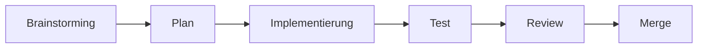

# Agentic Workflow

> **Kern-Takeaway:** Struktur verhindert Nacharbeit.

## Der Entwicklungszyklus mit KI-Agenten

| Phase | Zweck | Output | KI-Unterstützung |
|-------|-------|--------|------------------|
| **Brainstorming** | Anforderungen verstehen, Lösungsraum explorieren | Klare Aufgabenbeschreibung | Agent stellt Rückfragen, deckt Lücken auf |
| **Plan** | Lösungsansatz definieren, in Teilaufgaben zerlegen | Implementierungsplan mit Schritten | Agent erstellt strukturierten Plan |
| **Implementierung** | Code schreiben, TDD-Disziplin einhalten | Funktionierender Code mit Tests | Agent generiert Code nach Kontext |
| **Test** | Vollständigkeit und Korrektheit prüfen | Grüne Tests, Abdeckung erreicht | Agent schreibt und führt Tests aus |
| **Review** | Qualität, Sicherheit, Konventionen prüfen | Review-Feedback, ggf. Korrekturen | Review-Agent prüft automatisch |
| **Merge** | Änderungen integrieren, dokumentieren | Sauberer Commit | Agent erstellt Commit-Message |

Jede Phase filtert Fehler heraus, die in späteren Phasen teurer zu beheben wären.

## Vier Bausteine eines Plugin-Systems

| Baustein | Analogie | Was er tut | Beispiel |
|----------|----------|------------|----------|
| **Commands** | Shell-Aliases mit KI | Automatisiert häufige Abläufe | `/commit` -- analysiert Änderungen, generiert Commit |
| **Skills** | Checklisten im Kopf | Definiert, *wie* der Agent arbeitet | TDD-Skill -- erzwingt Test-First |
| **Agents** | Fachkollegen im Team | Spezialisierte Sub-Agenten für Teilaufgaben | Code-Reviewer -- prüft Qualität |
| **Hooks** | CI/CD-Triggers lokal | Reagiert automatisch auf Ereignisse | Pre-Commit -- Linter bei jedem Commit |

## Vibe Coding vs. Agentic Workflow

| | Vibe Coding | Agentic Workflow |
|--|-------------|------------------|
| **Vorgehen** | Einfach drauflos prompten | Strukturierter Zyklus (6 Phasen) |
| **Qualität** | Funktioniert, aber unstrukturiert | Getestet, reviewed, konventionskonform |
| **Geeignet für** | Prototypen, Exploration, Lernen | Produktionscode, Semesterarbeit |
| **Risiko** | Nacharbeit, technische Schulden | Geringer -- Fehler werden früh erkannt |

**Faustregel:** Vibe Coding für den ersten Entwurf -- Agentic Workflow für alles, was bestehen bleiben soll.

---

*AISE Modul 1 -- PVA 1 | FFHS*
