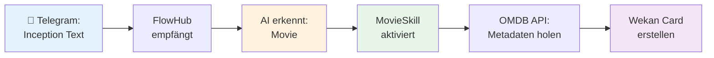
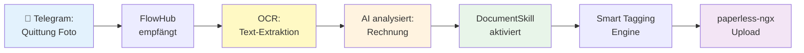
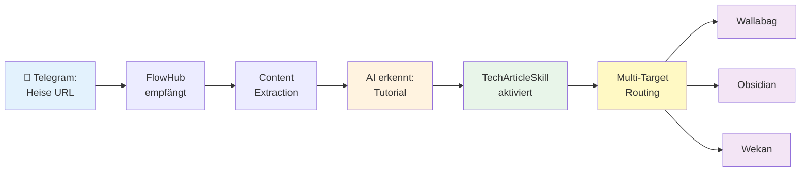
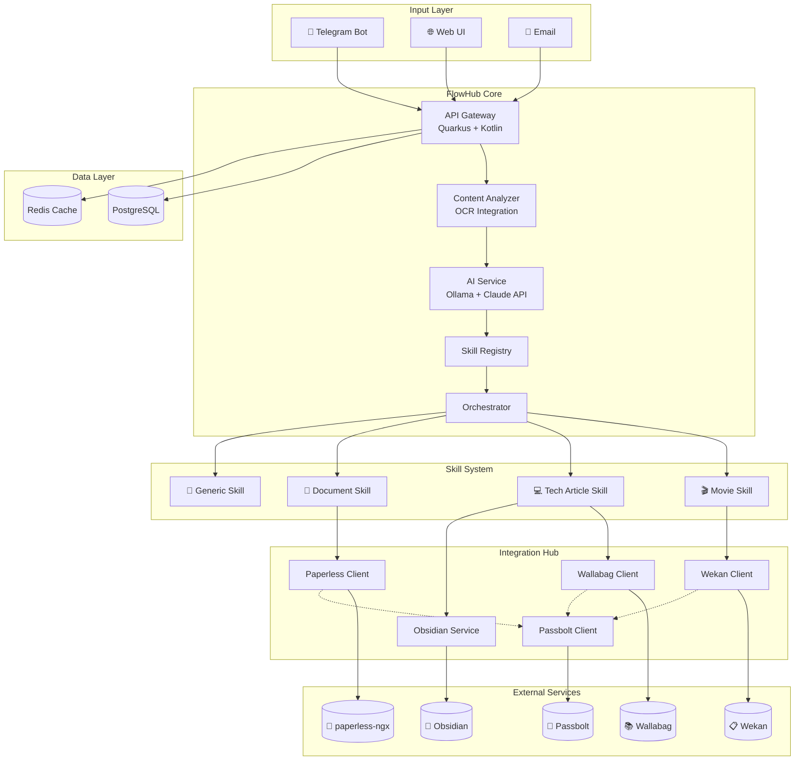

# FlowHub

## AI-Powered Personal Information Hub

  

**Projektbeschreibung**  

CAS AI-Assisted Software Engineering (AISE)  

Fernfachhochschule Schweiz (FFHS)

  

**Datum:** 14. Februar 2026

  

---

  

## 1. Stakeholder

  

### Primäre Stakeholder

- **Projektleiter/Entwickler:** Homelab-Betreiber und Knowledge Worker als Entwickler und Hauptnutzer

- **End-User:** Tägliche Nutzung für persönliches Information Management

  

### Sekundäre Stakeholder

- **Homelab-Community:** Potenzielle zukünftige User bei Open-Source-Veröffentlichung

- **Digital Hoarders / Information Manager:** Personen mit ähnlichen Workflow-Problemen

  

### Tertiäre Stakeholder

- **CAS-Dozenten:** Bewertung des Projekts im Rahmen des CAS AISE

- **Kommilitonen:** Potenzieller Erfahrungsaustausch und Feedback

  

---

  

## 2. Vision

  

### Vision Statement

> "Ein intelligenter, erweiterbarer Eingangskorb mit Skill-System, der digitale Informationsschnipsel automatisch analysiert, mit relevanten Metadaten anreichert und strukturiert an die richtigen Ziel-Services routet – damit der Fokus auf dem Wesentlichen liegt statt auf manuellem Sortieren."

  

### Langfristige Vision

> "FlowHub entwickelt sich zum persönlichen AI-Assistenten für Information Management, der nicht nur kategorisiert, sondern auch Zusammenhänge erkennt, proaktiv Vorschläge macht und durch ein dynamisches Skill-System kontinuierlich an neue Bedürfnisse anpassbar ist."

  

---

  

## 3. Grundsätzliches Kundenbedürfnis

  

### Problem (Pain Points)

  

**Fragmentierte Workflows:**

- Informationsschnipsel sammeln sich täglich in verschiedenen Kanälen (Signal "Note to Self", Handy-Fotos, Email, Browser-Tabs)

- Manuelles Sortieren und Ablegen kostet 15-30 Minuten täglich

- Kontext-Switching zwischen 5-10 verschiedenen Tools (Todoist, Obsidian, Wallabag, paperless-ngx, etc.)

  

**Spezifische Use Cases:**

- **Geschenkidee-Foto:** Produkt fotografieren → Manuell in Geschenkideen-Liste übertragen

- **Tech-Artikel URL:** Entscheiden: Read-Later? Obsidian? Todo-Liste? Oft landet es nirgends

- **Quittung/Beleg:** Foto machen → OCR → Manuell taggen → In paperless-ngx hochladen

- **Film-Empfehlung:** In Todoist eintragen → IMDB-Link suchen → Metadaten kopieren

- **Arztnotiz:** Strukturiert in Obsidian ablegen (Datum, Arzt, Befund, Follow-up)

- **Homelab-Artikel:** Wallabag + Obsidian + evtl. Kanban-Todo (dreifache Arbeit)

  

**Kognitive Last:**

- Entscheidungsmüdigkeit: "Wo soll das hin?"

- Informationsverlust durch Prokrastination

- Doppelarbeit durch fehlende Metadaten

  

### Bedürfnis: Automatisierung & Intelligenz

  

- Input einmal erfassen → System entscheidet automatisch wohin

- Intelligente Kategorisierung ohne manuelle Regeln

- Kontextuelle Metadaten-Anreicherung (IMDB, OCR, Wikipedia)

- Ein zentraler Eingangskorb für alle Input-Arten (Text, URL, Foto, PDF)

- Lokale Verarbeitung im Homelab für Privacy & Datenkontrolle

  

---

  

## 3.1 Workflow-Beispiele: Vorher vs. Nachher

  

Die folgenden drei Beispiele illustrieren, wie FlowHub den täglichen Umgang mit Informationsschnipseln fundamental verändert:

  

### Beispiel 1: Film-Empfehlung verarbeiten

  

#### 📱 Input (via Telegram)

```

"Inception - Christopher Nolan Film,

muss ich unbedingt nochmal schauen!"

```

  

#### ❌ **VORHER - Manueller Workflow (5 Minuten)**

  

1. **Schritt 1:** Notiz in Signal/Telegram lesen

2. **Schritt 2:** Todoist/Wekan öffnen

3. **Schritt 3:** Neue Karte/Task erstellen: "Inception schauen"

4. **Schritt 4:** Google öffnen → "Inception IMDB" suchen

5. **Schritt 5:** IMDB-Link kopieren

6. **Schritt 6:** Rating ablesen (8.8/10)

7. **Schritt 7:** Zurück zu Wekan → Link einfügen

8. **Schritt 8:** Manuell Notiz hinzufügen: "Christopher Nolan, Sci-Fi, 2010"

9. **Schritt 9:** Tags setzen: #movie #towatch #scifi

10. **Schritt 10:** Telegram-Nachricht löschen

  

**Resultat:** Task in Wekan, aber ohne Poster, ohne vollständige Metadaten

  

---

  

#### ✅ **NACHHER - FlowHub Automation (10 Sekunden)**

  



  

**FlowHub-Workflow:**

1. **AI-Kategorisierung:** "Movie-Empfehlung erkannt" (Confidence: 95%)

2. **MovieSkill aktiv:** Extrahiert "Inception" als Filmtitel

3. **OMDB API Call:** Automatischer Abruf aller Metadaten

4. **Wekan Integration:**

   - **Card-Titel:** "Inception (2010)"

   - **Beschreibung:** "A thief who steals corporate secrets through dream-sharing technology..."

   - **Custom Fields:**

     - IMDB Rating: 8.8/10

     - Director: Christopher Nolan

     - Genre: Sci-Fi, Action, Thriller

     - Runtime: 148 min

   - **Cover:** Offizielles Movie Poster (automatisch)

   - **Labels:** #movie #towatch #scifi #nolan

   - **Link:** https://www.imdb.com/title/tt1375666

  

5. **Notification:** ✅ "Film zu 'Movies to Watch' hinzugefügt"

  

**Resultat:** Vollständige, professionell aussehende Wekan-Card mit allen Metadaten

  

---

  

### Beispiel 2: Quittung für Steuer verarbeiten

  

#### 📸 Input (via Telegram)

Foto einer Quittung:

```

Hetzner Online GmbH

Rechnung Nr. 2025-01-12345

Dedicated Server EX44

Betrag: 49.90 EUR

Datum: 15.01.2025

USt-IdNr: DE123456789

```

  

#### ❌ **VORHER - Manueller Workflow (8 Minuten)**

  

1. **Schritt 1:** Foto von Handy auf PC übertragen

2. **Schritt 2:** paperless-ngx Web-UI öffnen

3. **Schritt 3:** Dokument hochladen

4. **Schritt 4:** Warten auf automatisches OCR (1-2 Min)

5. **Schritt 5:** Dokument öffnen

6. **Schritt 6:** Titel manuell setzen: "Hetzner Rechnung Januar 2025"

7. **Schritt 7:** Correspondent suchen → "Hetzner" auswählen (oder neu anlegen)

8. **Schritt 8:** Datum manuell setzen: 15.01.2025

9. **Schritt 9:** Tags überlegen und setzen:

   - #rechnung

   - #hosting

   - #steuern

   - #2025

   - #betriebsausgabe

10. **Schritt 10:** Kategorie: "IT-Infrastruktur"

11. **Schritt 11:** Speichern

  

**Resultat:** Dokument in paperless-ngx, aber mühsam manuell getaggt

  

---

  

#### ✅ **NACHHER - FlowHub Automation (15 Sekunden)**

  



  

**FlowHub-Workflow:**

1. **OCR (Tesseract):** Text-Extraktion aus Foto

   ```

   "Hetzner Online GmbH, Rechnung Nr. 2025-01-12345,

    Dedicated Server EX44, 49.90 EUR, 15.01.2025..."

   ```

  

2. **AI-Analyse (Ollama):**

   ```json

   {

     "document_type": "rechnung",

     "correspondent": "Hetzner Online GmbH",

     "title": "Dedicated Server EX44",

     "date": "2025-01-15",

     "amount": 49.90,

     "currency": "EUR",

     "category": "hosting",

     "tax_relevant": true

   }

   ```

  

3. **Smart Tagging Engine:**

   - **Base Tags:** #rechnung, #hosting, #hetzner

   - **Year Tag:** #steuern-2025 (weil tax_relevant: true)

   - **Rule-based:** #betriebsausgabe (hosting + Rechnung)

   - **Auto-generated:** #server, #infrastruktur

  

4. **paperless-ngx Integration:**

   - **Correspondent:** "Hetzner Online GmbH" (auto-matched oder erstellt)

   - **Title:** "Hetzner - Dedicated Server EX44 - Januar 2025"

   - **Date:** 15.01.2025

   - **Tags:** Alle oben genannten

   - **Document Type:** "Rechnung/Invoice"

   - **Custom Fields:**

     - Betrag: 49.90 EUR

     - Steuerrelevant: Ja

     - Kategorie: IT-Infrastruktur

  

5. **Notification:** ✅ "Rechnung gespeichert mit 7 Tags"

  

**Resultat:** Perfekt kategorisiertes Dokument, steuerfertig getaggt

  

---

  

### Beispiel 3: Tech-Artikel für Homelab

  

#### 🔗 Input (via Telegram)

```

https://www.heise.de/artikel/Docker-Compose-

Best-Practices-fuer-Production-9876543.html

  

"Das muss ich für mein Homelab ausprobieren!"

```

  

#### ❌ **VORHER - Manueller Workflow (7 Minuten)**

  

1. **Schritt 1:** Link im Browser öffnen

2. **Schritt 2:** Artikel überfliegen → Entscheiden wohin

3. **Schritt 3:** Wallabag öffnen → URL einfügen → Speichern (Read Later)

4. **Schritt 4:** Obsidian öffnen

5. **Schritt 5:** Neues Note: "Docker Compose Best Practices"

6. **Schritt 6:** Link kopieren, Notiz schreiben:

   ```

   # Docker Compose Best Practices

   Quelle: https://heise.de/...

   TODO: Durchlesen und für Homelab umsetzen

   Tags: #homelab #docker #tutorial

   ```

7. **Schritt 7:** Wekan öffnen

8. **Schritt 8:** Neue Card: "Docker Compose Best Practices umsetzen"

9. **Schritt 9:** Link in Card-Beschreibung

10. **Schritt 10:** Label: #homelab #todo

  

**Resultat:** In 3 verschiedenen Tools erfasst, aber mühsam

  

---

  

#### ✅ **NACHHER - FlowHub Automation (12 Sekunden)**

  



  

**FlowHub-Workflow:**

1. **Content Extraction:** Artikel-Metadaten abrufen

   ```json

   {

     "title": "Docker Compose Best Practices für Production",

     "source": "heise.de",

     "author": "Max Mustermann",

     "published": "2025-02-10",

     "excerpt": "Optimale Konfiguration für produktive Container..."

   }

   ```

  

2. **AI-Klassifizierung (Claude API):**

   ```json

   {

     "article_type": "tutorial",

     "topics": ["docker", "docker-compose", "devops", "production"],

     "complexity": "intermediate",

     "actionable": true,

     "homelab_relevant": true

   }

   ```

  

3. **TechArticleSkill - Multi-Target Routing:**

  

   **→ Wallabag (Read Later):**

   - URL gespeichert

   - Tags: #docker #tutorial #production

   - Status: "Unread"

  

   **→ Obsidian (Knowledge Base):**

   - Datei: `/Homelab/Docker-Compose-Best-Practices.md`

   - Inhalt:

     ```markdown

     # Docker Compose Best Practices für Production

     **Quelle:** [heise.de](https://...)

     **Datum:** 2025-02-10

     **Autor:** Max Mustermann

     ## Notizen

     - [ ] Artikel durchlesen

     - [ ] Best Practices auf Homelab-Setup anwenden

     - [ ] docker-compose.yml Files überarbeiten

     ## Zusammenfassung

     Optimale Konfiguration für produktive Container...

     #homelab #docker #tutorial #production

     ```

  

   **→ Wekan (Todo):**

   - Board: "Homelab"

   - List: "To Do"

   - Card: "Docker Compose Best Practices umsetzen"

   - Beschreibung: Link + Excerpt

   - Labels: #homelab #docker #tutorial

   - Due Date: +7 Tage

  

4. **Notification:**

   ✅ "Artikel gespeichert in Wallabag, Obsidian & Wekan"

  

**Resultat:** Ein Input → Drei Ziele, perfekt verlinkt und strukturiert

  

---

  

### Zeitersparnis-Übersicht

  

| Use Case | Manuell | FlowHub | Ersparnis |

|----------|---------|---------|-----------|

| Film-Empfehlung | 5 Min | 10 Sek | **96%** |

| Quittung/Beleg | 8 Min | 15 Sek | **97%** |

| Tech-Artikel | 7 Min | 12 Sek | **97%** |

| **Durchschnitt** | **6-7 Min** | **~12 Sek** | **~96%** |

  

**Bei 5 Snippets pro Tag:**

- **Vorher:** 30-35 Minuten/Tag → **3.5h/Woche** → **~180h/Jahr**

- **Nachher:** ~1 Minute/Tag → **7 Min/Woche** → **~6h/Jahr**

- **💰 Gewinn:** **~174 Stunden/Jahr** = **4.3 Arbeitswochen**

  

---

  

## 4. Wichtigste Funktionen

  

### A. MVP-Funktionen (Phase 1 - Must Have)

  

#### Input-Layer

- **Multi-Channel-Input:** Telegram Bot (mobil), Web UI (Desktop), Email-to-FlowHub

- **Multi-Format-Support:** Text/Notizen, URLs, Fotos/Bilder, PDF-Dateien

  

#### AI-Processing-Core

- **Automatische Kategorisierung:** Ollama (Llama 3.1 lokal auf Proxmox) und/oder Anthropic API (Claude Sonnet 4.5)

- **Erkennt:** Movie, Tech-Article, Document, Gift, Health, Generic

- **Confidence-Score:** User-Feedback bei Unsicherheit

- **OCR:** Tesseract für Dokumente/Fotos

  

#### Skill-System (Plugin-Architecture)

  

**MovieSkill:**

- IMDB/OMDB Integration

- Metadaten-Enrichment (Rating, Director, Year, Genre)

- Wekan Card-Erstellung in "Movies to Watch"

  

**TechArticleSkill:**

- Content-Extraction von URLs

- Klassifizierung: Tutorial vs. Tool vs. News

- Multi-Target Routing: Wallabag + Obsidian + optional Wekan-Todo

  

**DocumentSkill:**

- OCR-Verarbeitung für Belege/Quittungen

- Entity-Extraction (Betrag, Datum, Firma)

- Smart Tagging (#steuern-2025, #betriebsausgabe)

- paperless-ngx Integration mit Metadaten

  

**GenericSkill:**

- Fallback für unbekannte Kategorien

- Inbox-Speicherung für manuelle Verarbeitung

  

#### Service-Integrationen

- **Wallabag** (Read-Later)

- **Wekan** (Kanban/Tasks)

- **paperless-ngx** (Dokumente)

- **Obsidian** (Knowledge Base - File-based)

- **Passbolt** (Credential Management)

  

#### Web Dashboard

- Inbox (ungeklärte Items)

- Manual Processing (AI-Vorschläge bestätigen/korrigieren)

- History (Routing-Protokoll)

- Collections (Geschenkideen, Quotes)

- Settings & Integration-Status

  

---

  

### B. Advanced Features (Phase 2 - Nice to Have)

  

- **Multi-Target Routing:** Ein Input → mehrere Ziel-Services gleichzeitig

- **Smart Enrichment:** Automatische Zusatzinfos (Wikipedia, Pricing, Context-Linking)

- **Skill Discovery:** AI schlägt neue Skills für unbekannte Patterns vor

- **User Feedback Loop:** System lernt aus Korrekturen

- **Analytics:** Statistiken über Verarbeitungsrate und Pattern-Erkennung

  

---

  

### C. Future Vision (Phase 3 - Long-term)

  

- **Obsidian RAG Integration:** Vector DB, Chat-Interface für Homelab-Doku, Semantische Suche

- **Proaktive Assistenz:** Smart Notifications, Context-Aware Suggestions, Automatisches Linking

  

---

  

## 5. System-Architektur

  

### Architektur-Diagramm

  



  

### Technische Architektur (Überblick)

  

#### Backend

- **Programmiersprache:** Kotlin (gemäß FFHS-Empfehlung für Quarkus, siehe Entwicklungsumgebung-Anleitung)

- **Framework:** Quarkus (Java/JEE-kompatibel)

- **Database:** PostgreSQL (Metadaten), Redis (Cache)

- **AI/LLM:** Ollama (Llama 3.1, lokal auf Proxmox) und/oder Anthropic API (Claude Sonnet 4.5) als Fallback

- **OCR:** Tesseract mit Image Enhancement

  

#### Technologie-Begründung: Kotlin

Die FFHS-Unterlagen empfehlen explizit: *"Anstelle von Java können Sie auch Kotlin verwenden. Quarkus und IntelliJ funktionieren ohnehin mit beiden Sprachen."* (Quelle: Entwicklungsumgebung-Anleitung, Moodle)

  

**Vorteile von Kotlin für dieses Projekt:**

- Modernere, prägnantere Syntax (weniger Boilerplate als Java)

- Null-Safety eingebaut

- Bessere Lesbarkeit für Code Reviews

- 100% Java-Interoperabilität (alle Quarkus-Features verfügbar)

- Hervorragende IntelliJ IDEA + JetBrains AI Unterstützung

  

#### Architecture Pattern

- **Start:** Modularer Monolith mit Skill-Registry (Plugin-Pattern)

- **Evolution:** Microservices (AI Service, Integration Service, Skill Services)

- **Design Patterns:** Strategy Pattern, Hexagonal Architecture

  

#### Integrationen

- REST Clients für alle Ziel-Services

- Passbolt für sichere Credential-Verwaltung

  

#### Deployment

- Docker Compose auf Proxmox Homelab

- Traefik/Nginx als Reverse Proxy

  

#### Frontend

- React oder Vue.js

- Responsive Web UI (Desktop + Mobile-Browser)

  

---

  

## 6. Projektwert & Impact

  

### Quantifizierbarer Nutzen

- **Zeitersparnis:** 15-30 Min/Tag → ~2 Min/Tag (80-90% Reduktion)

- **Datenqualität:** Strukturierte Metadaten statt Freitext

- **Kognitive Entlastung:** Keine "Wo soll das hin?"-Entscheidungen mehr

  

### Technischer Mehrwert

- Lerneffekt: Microservices, AI-Integration, Design Patterns, Kotlin

- Real-World-Tauglichkeit: Production-ready nach CAS nutzbar

- Erweiterbarkeit: Skill-System ermöglicht einfache Feature-Addition

  

### Kosten

- **Entwicklung:** ~€0-5 (optional Anthropic API für Claude)

- **Infrastruktur:** €0 (Homelab bereits vorhanden)

  

---

  

## 7. Erfüllung der CAS-Anforderungen

  

✅ **Verteilte Web-Applikation:** FlowHub Core + Multiple externe Services über REST APIs  

✅ **KI-Integration:** Ollama (Kategorisierung), Anthropic API (Claude), OCR, Metadaten-Enrichment  

✅ **KI-Agenten:** Skill-System als domänen-spezifische AI-Agents  

✅ **Microservices-Evolution:** Modularer Monolith → Services → Skill-Microservices  

✅ **Enterprise-Patterns:** Plugin/Strategy Pattern, Hexagonal Architecture, API Gateway  

✅ **Praxisrelevanz:** Löst echtes, tägliches Problem mit messbarem Impact

  

---

  

## 8. Zusammenfassung

  

FlowHub ist ein intelligenter Integration-Hub mit AI-gesteuertem Skill-System, der fragmentierte Informationsworkflows automatisiert. Durch lokale AI-Verarbeitung (Ollama) mit optionalem Fallback zur Anthropic API (Claude Sonnet 4.5), intelligentes Routing und domänen-spezifische Skills (Movie, Document, TechArticle) werden Informationsschnipsel automatisch kategorisiert, angereichert und an die richtigen Ziel-Services (Obsidian, Wekan, Wallabag, paperless-ngx) verteilt.

  

Das Projekt demonstriert moderne Software-Engineering-Practices (Microservices, Design Patterns, AI-Integration, Kotlin-Entwicklung) und liefert gleichzeitig einen praktischen Mehrwert durch signifikante Zeitersparnis und verbesserte Datenqualität im persönlichen Information Management. Die Architektur-Evolution vom modularen Monolithen zu Microservices zeigt den vollständigen Software-Lebenszyklus und erfüllt alle Anforderungen des CAS AISE.

  

---

  

## Eigenständigkeitserklärung

  

Hiermit erkläre ich,

  

- dass ich die vorliegende Arbeit selbstständig verfasst habe,

- dass alle sinngemäss und wörtlich übernommenen Textstellen aus fremden Quellen kenntlich gemacht wurden,

- dass alle mit Hilfsmitteln erbrachten Teile der Arbeit präzise deklariert wurden,

- dass keine anderen als die im Hilfsmittelverzeichnis aufgeführten Hilfsmittel verwendet wurden,

- dass das Thema, die Arbeit oder Teile davon nicht bereits Gegenstand eines Leistungsnachweises eines anderen Moduls waren, sofern dies nicht ausdrücklich mit der Referentin oder dem Referenten im Voraus vereinbart wurde,

- dass ich mir bewusst bin, dass meine Arbeit elektronisch auf Plagiate und auf Drittautorschaft menschlichen oder technischen Ursprungs überprüft werden kann und ich hiermit der FFHS das Nutzungsrecht so weit einräume, wie es für diese Verwaltungshandlungen notwendig ist.

  

---

  

## Hilfsmittelverzeichnis

  

| Hilfsmittel | Verwendungszweck | Betroffene Stellen |

|-------------|------------------|-------------------|

| Claude Sonnet 4.5 (Anthropic API) | Textgenerierung, Strukturierung, Formulierungshilfe | Gesamte Projektbeschreibung |

| Claude Sonnet 4.5 (Anthropic API) | Diagramm-Erstellung (Mermaid) | Architektur-Diagramm (Kapitel 5) |

| JetBrains AI Assistant | Code-Generierung, Refactoring | Kotlin/Quarkus Implementierung (geplant) |

  

---

  

**Ort, Datum:** _________________________

  

**Unterschrift:** _________________________