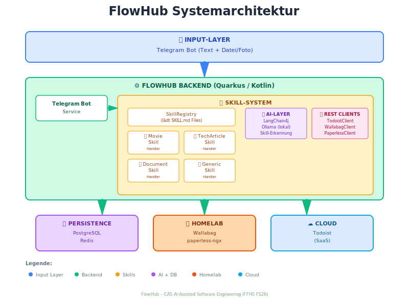

# FlowHub – Projektbeschreibung

**CAS AI-Assisted Software Engineering (AISE)**  
**W4B-C-AS001 · ZH-Sa-1 · FS26**  
**Student:** Andreas Imboden  
**Datum:** Februar 2026

---

## 1. Vision

> **FlowHub ist ein KI-gestützter persönlicher Eingangskorb, der Informationsschnipsel aus dem Alltag automatisch erkennt, kategorisiert und an die richtigen Services weiterleitet.**

Der digitale Alltag produziert ständig kleine Informationsfragmente: ein Film den man schauen möchte, ein Tech-Artikel zum Lesen, ein Foto eines Kassenbelegs. Heute landen diese Schnipsel verstreut in verschiedenen Apps, Chats oder werden schlicht vergessen.

FlowHub schafft **einen einzigen Eingang** für all diese Inputs und erledigt die Ablage automatisch – mit KI-Unterstützung und minimalem Aufwand für den Benutzer.

---

## 2. Stakeholder

### Primär: Homelab-Betreiber (Persona: Andreas)
- Technisch versierter Anwender
- Betreibt Self-Hosted Services im Heimnetzwerk (Proxmox, Docker)
- Nutzt bereits: Todoist, paperless-ngx, Passbolt, GitLab
- **Problem:** Informationsschnipsel landen überall, kein einheitlicher Eingang
- **Ziel:** Schnelle, reibungslose Erfassung von Alltagsinformationen via Telegram

### Sekundär: Digital Hoarders
- Sammeln Artikel, Bookmarks, Notizen in vielen Tools
- Frustriert durch manuelles Kategorisieren und Sortieren
- Würden von automatisierter Ablage profitieren

### Tertiär: CAS-Dozenten (FFHS)
- Erwarten: Verteilte Web-Applikation mit KI-Einsatz
- Erwarten: Saubere Software-Architektur-Dokumentation
- Erwarten: Reflexion über KI-unterstützte Entwicklung

---

## 3. Kundenbedürfnis

Das adressierte Kernbedürfnis ist **"Capture without friction"**: Der Benutzer möchte eine Information festhalten, ohne in diesem Moment entscheiden zu müssen, wohin sie gehört und wie sie abgelegt wird.

**Heute:**
```
Idee → Welche App? → App öffnen → Kategorisieren → Ablegen
= 5+ Schritte, Kontextwechsel, oft vergessen
```

**Mit FlowHub:**
```
Idee → Telegram Bot → Fertig
= 1 Schritt, KI übernimmt den Rest
```

---

## 4. Funktionsübersicht

### 4.1 MVP – CAS Projektarbeit

Der MVP-Scope ist bewusst eng gefasst. Komplexität wird durch saubere Architektur beherrscht, nicht durch Featureumfang.

#### Input-Kanal
| Feature | Beschreibung | Status |
|---------|-------------|--------|
| Telegram Bot (Text) | Textnachrichten empfangen und verarbeiten | ✅ MVP |
| Telegram Bot (Datei/Foto) | Dateianhänge empfangen und verarbeiten | ✅ MVP |

#### Skill-System (automatische Erkennung und Routing)
| Skill | Erkennung | Aktion | Ziel-Service |
|-------|-----------|--------|--------------|
| **MovieSkill** | Keywords: schauen, watch, film, movie | Todoist Task erstellen | Todoist |
| **TechArticleSkill** | URL erkannt (http/https) | Artikel speichern | Wallabag |
| **DocumentSkill** | Dateianhang (Foto/PDF) | Dokument hochladen | paperless-ngx |
| **GenericSkill** | Kein anderer Skill greift | In FlowHub Inbox ablegen | PostgreSQL |

#### Ziel-Services (Integrationen)
| Service | Typ | Integration | MVP-Umfang |
|---------|-----|-------------|------------|
| **Todoist** | Cloud SaaS | REST API | Task erstellen |
| **Wallabag** | Self-Hosted | REST API | URL speichern |
| **paperless-ngx** | Self-Hosted | REST API | Dokument hochladen |
| **FlowHub Inbox** | Eigene DB | PostgreSQL | Fallback-Speicher |

#### Benutzerinteraktion
| Feature | Beschreibung | Status |
|---------|-------------|--------|
| Direkte Verarbeitung | Klarer Input → sofortige Aktion | ✅ MVP |
| Rückfrage mit Auswahl | Unklarer Input → Bot fragt mit 2–3 Optionen zurück | ✅ MVP |
| Bestätigungs-Feedback | Bot antwortet mit Ergebnis | ✅ MVP |

#### KI-Integration
| Feature | Beschreibung | Status |
|---------|-------------|--------|
| Keyword-basierte Erkennung | Zuverlässiger Fallback ohne KI-Kosten | ✅ MVP |
| LangChain4j + Ollama | Lokales LLM für Skill-Erkennung | ✅ MVP (wenn Zeit reicht) |
| Confidence-Score | Schwellwert bestimmt ob Rückfrage nötig | ✅ MVP (wenn Zeit reicht) |

---

### 4.2 Future – Spätere Versionen (nach CAS)

Diese Features sind architekturell vorbereitet, werden aber nicht für die Abgabe implementiert. Sie belegen die Zukunftsfähigkeit der Architektur.

#### Erweiterte Skill-Funktionalität
| Skill | Erweiterung |
|-------|-------------|
| MovieSkill | IMDB/OMDB Metadaten (Titel, Rating, Jahr, Genre) |
| TechArticleSkill | Zusätzlich: Wekan Task + Obsidian Notiz erstellen |
| DocumentSkill | AI OCR-Analyse (Betrag, Datum, Händler, Tags) |
| GiftIdeaSkill | Geschenkideen → Todoist (Gifts Projekt) |
| NoteSkill | Notizen und Ideen → Obsidian |
| BookSkill | Bücher → Todoist + Obsidian |

#### Erweiterte Integrationen
| Service | Erweiterung |
|---------|-------------|
| Wekan | Kanban-Board für Homelab-Tasks |
| Obsidian | Knowledge Base via GitLab Sync |
| paperless-ngx | AI-gestützte Tagging und Metadaten-Extraktion |

#### Erweiterte KI-Features
| Feature | Beschreibung |
|---------|-------------|
| Lerneffekt | Nutzerverhalten verbessert Confidence über Zeit |
| RAG | Obsidian als Wissensbasis für den Assistenten |

#### Weitere Input-Kanäle
| Kanal | Beschreibung |
|-------|-------------|
| Email | Emails als Input verarbeiten |
| Web Upload | Browser-Extension oder Web-UI für Uploads |
| API | Direkte REST-API für Drittanwendungen |

#### Deployment-Evolution
| Phase | Beschreibung |
|-------|-------------|
| Phase 1 (MVP) | Docker Compose auf Proxmox Homelab |
| Phase 2 (Future) | Migration zu k3s (Kubernetes) |

---

## 5. Systemarchitektur

### 5.1 Überblick

<!-- In your markdown file -->


### 5.2 Hybrid Skill-System (Kernarchitektur)

FlowHub verwendet einen **Hybrid-Ansatz** für das Skill-System, der Code und Konfiguration kombiniert:

**`SKILL.md`** (Deklarativ, versioniert):
```yaml
---
name: movie-skill
description: Handles movie recommendations
handler: com.flowhub.skills.handlers.MovieSkillHandler
metadata:
  flowhub:
    triggers:
      keywords: [schauen, watch, film, movie]
    config:
      todoist_project: movies
---
# Dokumentation des Skills (für Menschen und KI lesbar)
```

**`MovieSkillHandler.kt`** (Business-Logic, typsicher):
```kotlin
@ApplicationScoped
class MovieSkillHandler : SkillHandler {
    override fun execute(input: InputItem, config: SkillConfig): SkillResult {
        todoistClient.createTask(...)
        return SkillResult(success = true)
    }
}
```

**Vorteile dieses Ansatzes:**
- Konfiguration ohne Neustart änderbar (SKILL.md)
- Typsichere Business-Logic (Kotlin)
- Selbstdokumentierend (Markdown human readable)
- Zukunftsfähig: KI kann SKILL.md Files lesen und generieren

### 5.3 Technologie-Stack

| Schicht | Technologie | Begründung |
|---------|-------------|------------|
| **Backend** | Quarkus / Kotlin | JVM-Ökosystem, Dev Mode |
| **KI-Integration** | LangChain4j + Ollama / Anthropic API Key | Ollama: lokal & kostenlos |
| **Datenbank** | PostgreSQL 16 | Bewährt |
| **Cache/State** | Redis 7 | Session-State, Pending Inputs |
| **API-Framework** | RESTEasy Reactive | Quarkus-nativ, reaktiv |
| **REST Clients** | MicroProfile REST Client | Typ-sicher, Quarkus-integriert |
| **Telegram** | kotlin-telegram-bot | Kotlin-native Library |
| **Deployment** | Docker Compose | Einfach, Proxmox-kompatibel |

### 5.4 Infrastruktur (Proxmox Homelab)

```
Proxmox VE
├── VM: Docker Host
│   ├── FlowHub Backend
│   ├── PostgreSQL
│   ├── Redis
│   └── Ollama (Llama 3.1)
│
├── VM/LXC: Wallabag          (Self-Hosted Read-Later)
├── VM/LXC: paperless-ngx     (bereits vorhanden)
└── VPS (extern, DE):
    └── GitLab                (bereits vorhanden)

Cloud:
└── Todoist                   (SaaS, bereits abonniert)
└── Anthropic API             (Claude, Fallback für KI)
```

---

## 6. Architekturentscheidungen (ADR)

### ADR-001: Kotlin statt C# oder Java

**Entscheidung:** Kotlin als primäre Sprache.

**Begründung:**
- FFHS setzt Kotlin/Quarkus als Referenz-Stack
- Prägnante Syntax (weniger Boilerplate als Java)
- Interoperabel mit Java-Bibliotheken
- Null-Safety reduziert Laufzeitfehler

**Konsequenz:** Initiale Lernkurve (~1 Woche), Code direkt für Produktivbetrieb nutzbar.

---

### ADR-002: Hybrid Skill-System (SKILL.md + Kotlin Handler)

**Entscheidung:** Kombination aus deklarativer Konfiguration (SKILL.md) und typsicherer Business-Logic (Kotlin).

**Begründung:**
- Pure Code: Gut testbar, keine Runtime-Konfiguration
- Pure Config: Flexible, aber keine Typsicherheit
- Hybrid: Best of Both Worlds

**Konsequenz:** Zwei Artefakte pro Skill (SKILL.md + Handler), aber maximale Flexibilität.

---

### ADR-003: Docker Compose jetzt, k3s als Future Option

**Entscheidung:** Docker Compose für MVP-Deployment.

**Begründung:**
- Schnellerer Start (1 Tag Setup vs. 1 Woche k8s)
- Einfacheres Debugging während Entwicklung
- Passt zu FFHS Block 5 Timeline (k8s im Juni)
- App ist von Beginn an k8s-ready (12-Factor, Health Checks, Stateless)

**Konsequenz:** Migration zu k3s als Block 5 Projekt möglich, ohne Code-Änderungen.

---

### ADR-004: Ollama (lokal) als primäres LLM

**Entscheidung:** Llama 3.1 via Ollama lokal, Anthropic API als Fallback.

**Begründung:**
- Ollama: Kostenlos, privat, offline-fähig
- Anthropic API: ~$6/Monat für Homelab-Nutzung, nur für hochwertige Aufgaben
- LangChain4j: Provider-Wechsel nur via Config, kein Code-Änderung

**Konsequenz:** 4.7 GB Model-Download, 4 GB RAM Bedarf für Ollama.

---

### ADR-005: paperless-ngx für Dokumenten-MVP als reines Upload-Ziel

**Entscheidung:** Im MVP fungiert paperless-ngx als Dokumenten-Archiv ohne KI-Analyse.

**Begründung:**
- Fokus auf funktionierende Grundstruktur, nicht Feature-Tiefe
- OCR und Metadaten-Extraktion sind komplex (separates Lernziel)
- paperless-ngx hat eigene gute Basis-Kategorisierung via Regeln

**Konsequenz:** DocumentSkill macht nur: Erkennen → Upload. Keine Tags, keine Metadaten-Extraktion im MVP.

**Future:** KI-gestützte Analyse des OCR-Texts (Betrag, Datum, Händler) via LangChain4j.

---

## 7. CAS-Kursstruktur und Projektfortschritt

### Mapping: FFHS Blöcke → FlowHub Entwicklung

| Block | Datum | FFHS Thema | FlowHub Deliverable |
|-------|-------|------------|---------------------|
| **1** | Feb 21 | Konzeption, Einführung | ✅ Projektbeschreibung, Architekturentwurf, ADRs |
| **2** | Mär 21 | Frontend, Web-Präsentation | Telegram Bot UI, Web-Dashboard (Admin-Ansicht) |
| **3** | Apr 25 | Services, REST, MCP | Skill-System, REST Clients (Todoist, Wallabag, paperless) |
| **4** | Mai 23 | Persistence, Datenbanken | PostgreSQL Schema, Redis State, Repository-Pattern |
| **5** | Jun 20 | Docker, Kubernetes | Docker Compose finalisiert, optional: k3s Migration |
| **Abgabe** | Jul 6 | – | Vollständiges MVP + Dokumentation + Git-Repository |

---

## 8. KI-Einsatz in der Entwicklung (Reflexion)

### KI-Tools im Entwicklungsprozess

| Werkzeug | Einsatzbereich |
|----------|---------------|
| **Claude (claude.ai)** | Architektur-Diskussion, Code-Reviews, Prototypen |
| **Claude Code CLI** | LXC-Deployment Scripts für Wallabag und Wekan |
| **Ollama / LangChain4j** | Skill-Erkennung zur Laufzeit (im Produkt) |
| **NotebookLM** | Lern-Podcasts aus FFHS-Leseempfehlungen |

### Beobachtungen

- **Architektur-Diskussion:** KI sehr hilfreich für Abwägen von Alternativen (z.B. Hybrid vs. Pure-Code Skill-System)
- **Scope-Kontrolle:** KI neigt dazu, Features vorzuschlagen – bewusste Eingrenzung auf MVP notwendig
- **Code-Generierung:** Spart Boilerplate, muss aber reviewed werden
- **Prototyping:** KI ermöglicht schnelles Explorieren von Technologien (LangChain4j, Telegram API)

---

## 9. Abgrenzung: Was FlowHub nicht ist

- ❌ **Kein allgemeiner Chatbot** – FlowHub hat eine klar definierte Aufgabe
- ❌ **Kein Ersatz für paperless-ngx / Todoist** – FlowHub ergänzt, ersetzt nicht
- ❌ **Kein IFTTT/n8n Clone** – FlowHub ist code-basiert, nicht no-code
- ❌ **Keine Multi-User-Plattform** – Single-User Homelab-Tool

---

## 10. Risiken und Mitigationen

| Risiko | Wahrscheinlichkeit | Mitigation |
|--------|-------------------|------------|
| Scope Creep (zu viele Features) | Hoch | Klare MVP-Liste, Future klar abgegrenzt |
| Komplexe Kotlin-Lernkurve | Mittel | Quarkus Dev Mode beschleunigt Feedback; C# Hintergrund hilft |
| Ollama zu langsam (kein GPU) | Mittel | Claude API als Fallback; Keyword-Detection als Basis |
| Telegram API Änderungen | Niedrig | Abstraktion via SkillHandler Interface |
| Zeitdruck (Abgabe Juli) | Mittel | MVP bewusst schlank, Future Features dokumentiert |

---

## 11. Glossar

| Begriff | Bedeutung |
|---------|-----------|
| **Skill** | Handler für einen bestimmten Input-Typ (z.B. MovieSkill) |
| **SKILL.md** | Konfigurationsdatei eines Skills (YAML Frontmatter + Markdown) |
| **SkillHandler** | Kotlin-Klasse mit der Business-Logic eines Skills |
| **SkillRegistry** | Lädt alle SKILL.md Files und zugehörige Handler |
| **Pending Input** | Input der auf Benutzer-Bestätigung wartet (in Redis) |
| **Confidence** | Wie sicher die KI bei der Skill-Erkennung ist (0.0–1.0) |
| **Homelab** | Selbst betriebene Server-Infrastruktur zu Hause (Proxmox) |

---

*Erstellt mit Unterstützung von Claude (Anthropic) – gemäss FFHS Richtlinien für KI-Einsatz in Projektarbeiten.*
