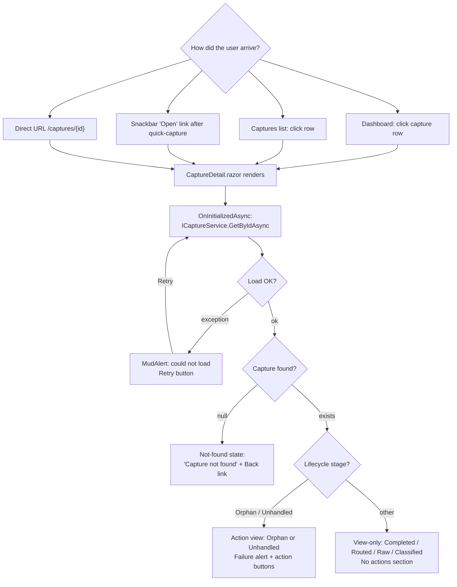
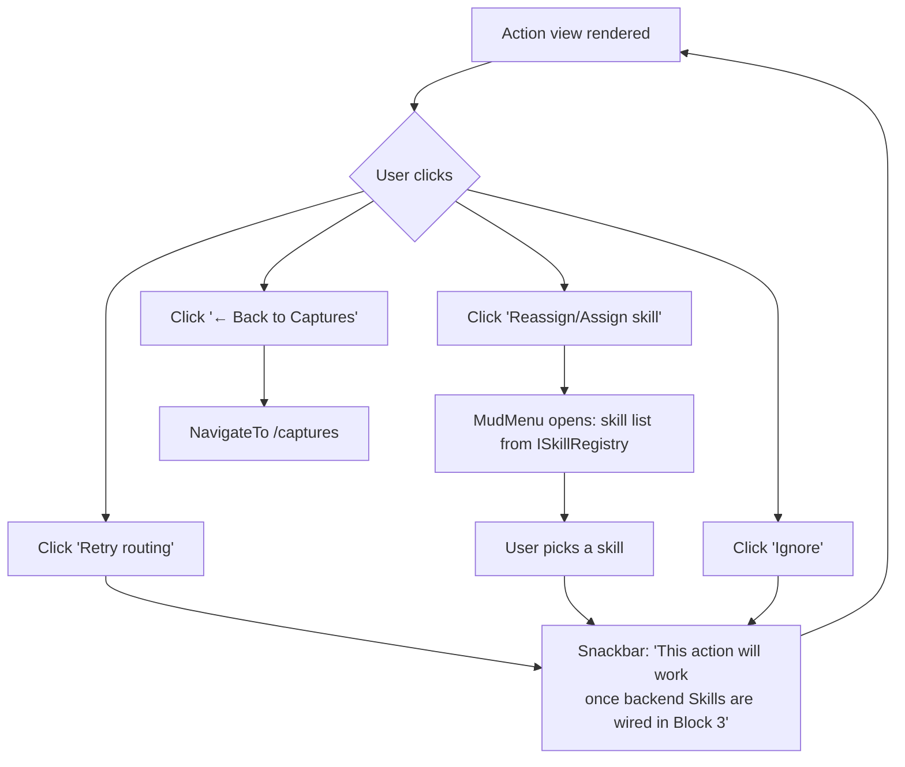
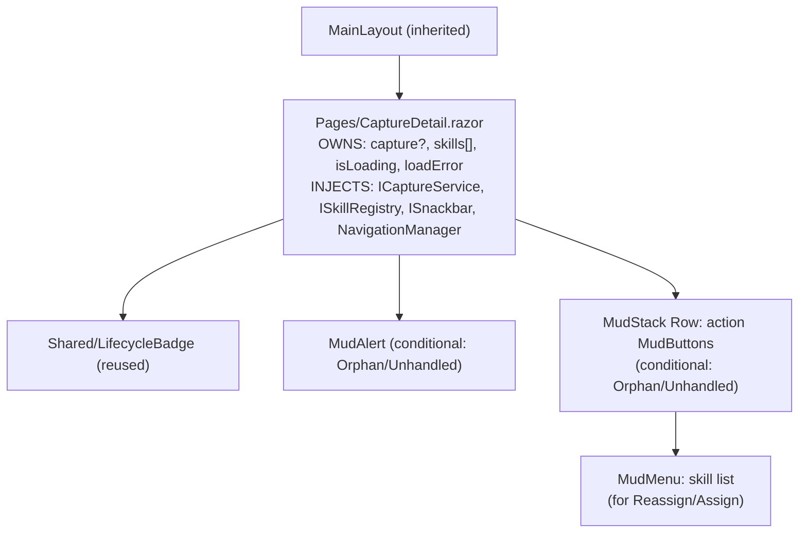

# Capture Detail — Flow Diagrams (Phase 2)

- **Page route:** `/captures/{id:guid}`
- **Render mode:** Interactive Server (per ADR 0001)
- **Status:** Approved 2026-04-10
- **Phase:** 2 of 4 (`/ui-flow`)
- **Predecessor:** [`wireframe.md`](./wireframe.md)
- **Next phase:** `/ui-build` — Razor component implementation

## Diagram 1 — Entry & loading

## Diagram 2 — Actions (all stubbed in Block 2)

## Diagram 3 — Component hierarchy

### State & data flow

| Component | Owns | Receives | Calls |
|---|---|---|---|
| `CaptureDetail` | `capture?`, `skills[]`, `isLoading`, `loadError` | `{Id}` route param | `ICaptureService.GetByIdAsync`, `ISkillRegistry.GetHealthAsync`, `ISnackbar.Add`, `NavigationManager.NavigateTo` |

Flat page, no child components, no EventCallbacks.

### Implied surfaces

| # | Surface | Already exists? | Action needed |
|---|---|---|---|
| 1 | `GetByIdAsync(Guid)` on `ICaptureService` | No | Add to interface + stub |
| 2 | `FailureReason` on `Capture` record | No | Add nullable string field |
| 3 | Skill list for MudMenu | Yes (`ISkillRegistry.GetHealthAsync`) | None |

No new pages, no new dialogs, no new shared components.
