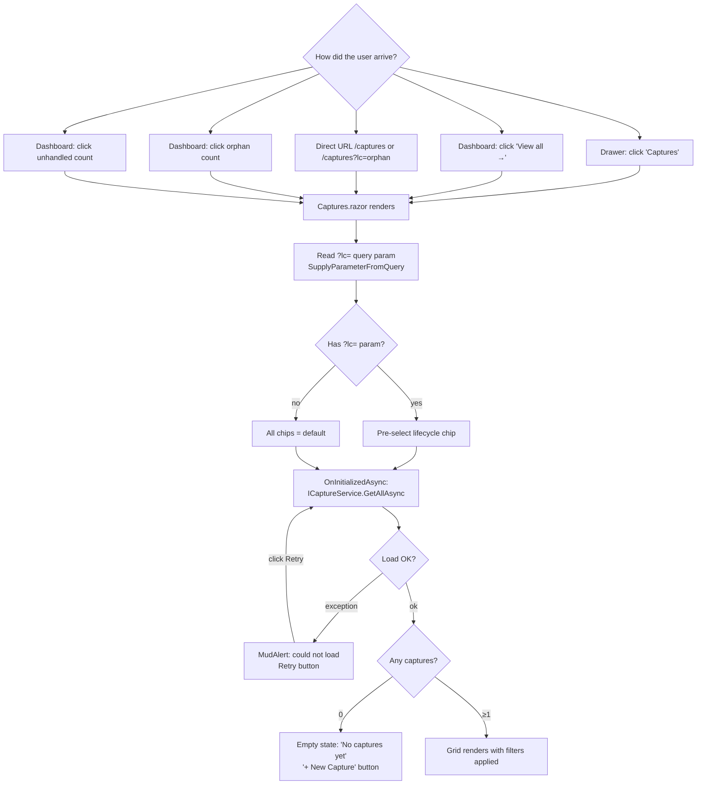
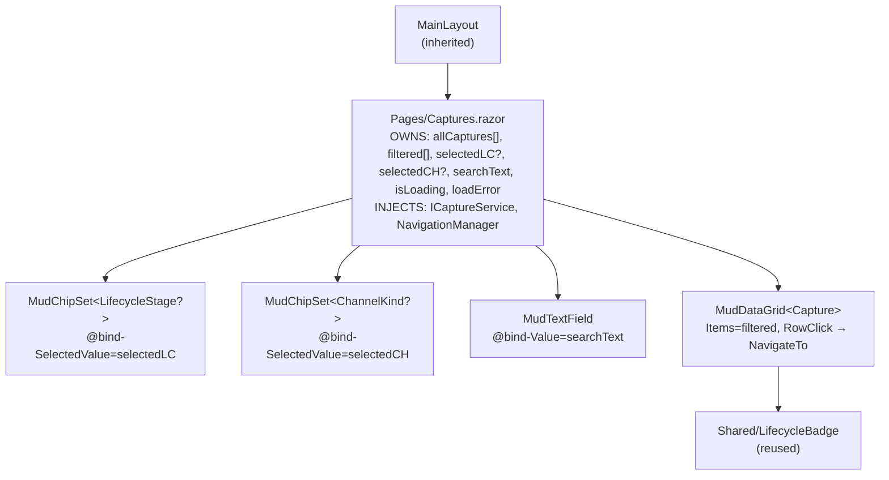

# Captures List — Flow Diagrams (Phase 2)

- **Page route:** `/captures`
- **Render mode:** Interactive Server (per ADR 0001)
- **Status:** Approved 2026-04-10
- **Phase:** 2 of 4 (`/ui-flow`)
- **Predecessor:** [`wireframe.md`](./wireframe.md)
- **Next phase:** `/ui-build` — Razor component implementation

## Diagram 1 — Entry & data loading



## Diagram 2 — Filter & interaction loop

```mermaid
flowchart TD
    Ready[Grid rendered with data]
    Action{User action}
    ClickLC[Click lifecycle chip]
    ClickCH[Click channel chip]
    TypeSearch[Type in search field]
    ClearSearch[Click ✕ in search field]
    ClearAll[Click 'Clear filters'<br/>from no-match empty state]
    ApplyFilter[Recompute filtered list:<br/>lifecycle ∩ channel ∩ search]
    FilterResult{Any matches?}
    ShowFiltered[Grid shows filtered rows<br/>Results counter updates]
    NoMatch[No-match empty state:<br/>'No captures match' + Clear filters]
    RowClick[Click a row]
    NavDetail[NavigateTo /captures/{id}]

    Ready --> Action
    Action --> ClickLC & ClickCH & TypeSearch & ClearSearch & ClearAll & RowClick
    ClickLC & ClickCH & TypeSearch & ClearSearch & ClearAll --> ApplyFilter
    ApplyFilter --> FilterResult
    FilterResult -- ≥1 --> ShowFiltered --> Action
    FilterResult -- 0 --> NoMatch --> Action
    RowClick --> NavDetail
```

## Diagram 3 — Component hierarchy & state ownership



### State & data flow

| Component | Owns | Receives | Calls |
|---|---|---|---|
| `Captures` | `allCaptures[]`, `filtered[]`, `selectedLC?`, `selectedCH?`, `searchText`, `isLoading`, `loadError` | `?lc=` via `[SupplyParameterFromQuery]` | `ICaptureService.GetAllAsync`, `NavigationManager.NavigateTo` |
| `MudChipSet<LifecycleStage?>` | — | `@bind-SelectedValue` | — |
| `MudChipSet<ChannelKind?>` | — | `@bind-SelectedValue` | — |
| `MudTextField` | — | `@bind-Value` | — |
| `MudDataGrid<Capture>` | pagination state (internal) | `Items=filtered` | — |

### Filtering logic (`ApplyFilters()`)

1. Start with `allCaptures`
2. If `selectedLC` is not null → `.Where(c => c.Stage == selectedLC)`
3. If `selectedCH` is not null → `.Where(c => c.Source == selectedCH)`
4. If `searchText` is not empty → `.Where(c => c.Content.Contains(searchText, OrdinalIgnoreCase))`
5. Assign to `filtered`

### Implied surfaces

| # | Surface | Already exists? | Action needed |
|---|---|---|---|
| 1 | `GetAllAsync()` on `ICaptureService` | No | Add to interface + stub |
| 2 | Row click → `/captures/{id}` | Yes — stub page | None |
| 3 | "New Capture" button in empty state → `/captures/new` | Yes — page exists | None |

### Deliberately not in scope

- Server-side filtering/pagination — Block 4
- Debounced search — overkill for 12 in-memory items
- Multi-select lifecycle filter — single-select per chip set is enough
