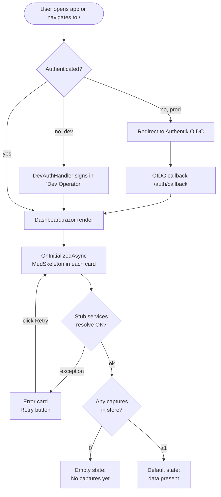
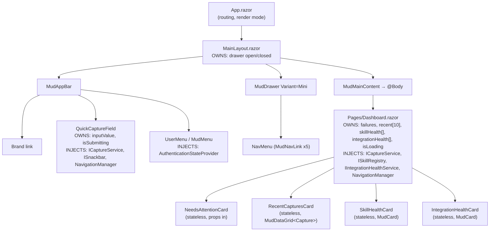

# Dashboard — Flow Diagrams (Phase 2)

- **Page route:** `/`
- **Render mode:** Interactive Server (per ADR 0001)
- **Status:** Approved 2026-04-09
- **Phase:** 2 of 4 (`/ui-flow`)
- **Predecessor:** [`wireframe.md`](./wireframe.md)
- **Next phase:** `/ui-build` — Razor components + shared layout shell

## Diagram 1 — Entry & load lifecycle



`Default` and `Empty` are entry points to Diagram 2.

## Diagram 2 — Interactions on the loaded Dashboard

```mermaid
flowchart TD
    Default[Default state]
    Action{User action}
    RowClick[Navigate /captures/{id}]
    OrphanClick[Navigate /captures?lc=orphan]
    UnhandClick[Navigate /captures?lc=unhandled]
    ViewAll[Navigate /captures]
    SkillsLink[Navigate /skills]
    IntegrLink[Navigate /integrations]
    DrawerNav[Navigate other Page<br/>from drawer]
    UserMenu{User menu}
    Theme[Toggle theme<br/>persisted in cookie]
    Logout[OIDC sign-out<br/>→ Authentik logout endpoint]
    Profile[Profile dialog<br/>placeholder Block 2]

    Default --> Action
    Action -- click capture row --> RowClick
    Action -- click orphan count --> OrphanClick
    Action -- click unhandled count --> UnhandClick
    Action -- click View all → --> ViewAll
    Action -- click Manage skills → --> SkillsLink
    Action -- click Manage integr → --> IntegrLink
    Action -- click drawer item --> DrawerNav
    Action -- click avatar --> UserMenu
    UserMenu --> Theme
    UserMenu --> Logout
    UserMenu --> Profile
```

The AppBar Quick Capture is **not** in this diagram — it lives in `MainLayout` and is shared across every Page. See Diagram 3.

## Diagram 3 — Quick Capture submission (cross-cutting, lives in AppBar)

```mermaid
flowchart TD
    Idle[QuickCaptureField idle<br/>empty input]
    Type[User types or pastes]
    Submit{Submit trigger}
    Validate{Input non-empty?}
    Optimistic[isSubmitting = true<br/>spinner in adornment]
    Call[ICaptureService.Submit<br/>source: WebChannel]
    Result{Service result}
    Success[Snackbar 'Captured ✓'<br/>with link to /captures/&#123;id&#125;]
    Failure[Snackbar 'Capture failed'<br/>keep input content]
    Reset[Clear input<br/>isSubmitting = false]
    KeepInput[Restore input<br/>isSubmitting = false]
    NoOp[Inline hint:<br/>Type something first]

    Idle --> Type --> Submit
    Submit -- Enter or click ⏎ --> Validate
    Validate -- no --> NoOp --> Idle
    Validate -- yes --> Optimistic --> Call --> Result
    Result -- ok --> Success --> Reset --> Idle
    Result -- exception --> Failure --> KeepInput --> Idle
```



This flow runs from **any** Page; it is intentionally diagrammed once.

## Diagram 4 — Component hierarchy & state ownership



### State & data flow rules

| Component | Owns | Receives (props) | Calls (services) | Emits (EventCallback) |
|---|---|---|---|---|
| `MainLayout` | drawer open/closed | — | — | — |
| `QuickCaptureField` | `inputValue`, `isSubmitting` | — | `ICaptureService.Submit`, `ISnackbar.Add`, `NavigationManager.NavigateTo` | — |
| `UserMenu` | menu open/closed | — | `SignOutManager.SignOut` (placeholder Block 2) | — |
| `Dashboard` | `failures`, `recent`, `skillHealth`, `integrationHealth`, `isLoading` | — | `ICaptureService.GetRecent(10)`, `GetFailureCounts()`, `ISkillRegistry.GetHealth()`, `IIntegrationHealthService.GetHealth()`, `NavigationManager.NavigateTo` | — |
| `NeedsAttentionCard` | — | `orphanCount`, `unhandledCount`, `OnOrphanClick`, `OnUnhandledClick` | — | `OnOrphanClick`, `OnUnhandledClick` (parent navigates) |
| `RecentCapturesCard` | — | `IReadOnlyList<Capture>`, `OnRowClick` | — | `OnRowClick(captureId)` (parent navigates) |
| `SkillHealthCard` | — | `IReadOnlyList<SkillHealth>` | — | — |
| `IntegrationHealthCard` | — | `IReadOnlyList<IntegrationHealth>` | — | — |

**Rule 1:** all four content cards are **stateless** — props down, `EventCallback` up. The Dashboard Page is the single data owner and the actor for navigation. Cards announce intent; the Page acts. (Mirrors `CLAUDE.md`'s "components don't call APIs directly" rule, applied to navigation.)

**Rule 2:** `QuickCaptureField` is the only component that *both* mutates server state and calls `ISnackbar` directly. It's an exception to Rule 1 because it lives in `MainLayout`, has no parent Page, and is shared across all Pages — no Page can sensibly own it.

## Implied surfaces NOT in the wireframe

The flow diagrams revealed these UI surfaces that the Phase 1 wireframe did not show explicitly. None are full new Pages.

| # | Surface | Where it lives | Decision deferred to Phase 3 |
|---|---|---|---|
| 1 | `MudSnackbarProvider` for Quick Capture success/error toasts | Wired once in `MainLayout` | Position: top-right (default) or bottom-center? |
| 2 | Theme toggle in user menu (light / dark / system) | `UserMenu` component | Persist where? Cookie (server) or localStorage (JS interop) |
| 3 | Profile dialog placeholder in user menu | `UserMenu` opens a `MudDialog` | Block 2: empty placeholder with "Profile coming in Block 5". Block 5: real Authentik profile data |
| 4 | Reconnect overlay when SignalR circuit drops | Blazor framework provides `<div id="components-reconnect-modal">` — needs theming | Style only, not a logic decision |

**No new routable Pages** are implied. All exits land on Pages already in the ADR's 7-page inventory.

**No destructive actions** on the Dashboard itself → no confirmation `MudDialog` flows here. Destructive actions live on Capture detail (mark ignored, retry routing, reassign skill) and get their own confirmation dialogs in that Page's flow.

## Deliberately deferred to Phase 3

- Razor markup and code-behind
- Stub service implementations and DI registration
- MudBlazor theming and snackbar positioning
- bUnit test scaffolding
