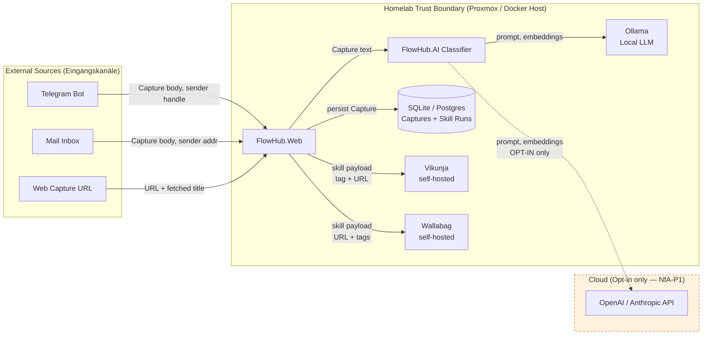
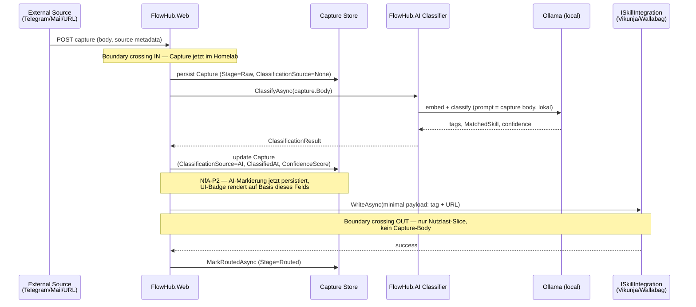

# Data Flow — Personendaten-Residenz & Trust Boundaries

This document is the canonical evidence artifact for **NfA-P1** (Personendaten-
Residenz) in `docs/spec/nfa.md`. It shows where Capture content lives, which
component is allowed to call outbound, and where the Homelab trust boundary
runs. The AI-Act-Transparenz-Pflicht aus NfA-P2 wird durch das
`ClassificationSource`-Feld im Sequenzdiagramm sichtbar gemacht.

**Stand:** Block 5 (2026-05-24). Architektur entspricht dem Beta-MVP
(`docs/superpowers/specs/2026-05-04-beta-mvp-design.md`) plus
Klassifikator (Block 3 Slice C, ADR 0004).

---

## A. Trust-Boundary-Übersicht (Strukturbild)

Statisches Bild: welche Datenkategorie überquert welche Grenze. Ein Pfeil
bedeutet "Daten fliessen in diese Richtung über die Boundary"; gestrichelte
Pfeile sind Opt-in-Pfade, die nur bei expliziter Konfiguration aktiviert
werden.

**Legende:**

| Symbol | Bedeutung |
|---|---|
| Durchgezogener Pfeil | Default-Pfad, immer aktiv |
| Gestrichelter Pfeil | Opt-in-Pfad, nur bei `Embeddings__Provider != "Local"` |
| Rahmen "Homelab Trust Boundary" | Alles innerhalb läuft auf vom Betreiber kontrollierter Hardware (Proxmox-VM, Docker-Host) |
| Rahmen "Cloud (Opt-in)" | Drittanbieter ausserhalb der Boundary; betreten der Boundary erzwingt Auftragsverarbeitungs-Pfad |
| `[(...)]` | Persistente Datenhaltung |
| `[...]` | Prozess / Service |

**Invarianten:**

- Es gibt genau drei Outbound-Konnektoren aus der Homelab-Boundary heraus:
  Vikunja, Wallabag und (optional) Cloud-LLM. Alle drei sind im
  `FlowHub.Skills`- bzw. `FlowHub.AI`-Modul kapselt; der Audit-Test
  `OutboundCallAuditTests` verifiziert, dass kein anderer Modul-Code
  HTTP-Aufrufe nach extern initiiert.
- Cloud-LLM-Pfad ist **per Default deaktiviert**. Aktivierung erfordert
  `Embeddings__Provider=OpenAI` + `Embeddings__ApiKey` als Environment-
  Variablen — bewusste Konfigurationsentscheidung mit DPA-Konsequenz.
- Capture-Bodies werden **nicht** an Vikunja oder Wallabag weitergereicht;
  Skill-Adapter übergeben nur den minimalen Nutzlast-Slice (Tag + URL).
  Dies hält die Outbound-Boundary auch dann sauber, wenn ein Skill-Target
  später durch einen Cloud-Dienst ersetzt würde.

---

## B. Capture-Lebenszyklus (Sequenzbild)

Dynamisches Bild eines einzelnen Captures vom Eingangskanal bis zur
Skill-Routing-Terminierung. Markiert, wann `ClassificationSource = "AI"`
gesetzt wird (NfA-P2-Hook) und wo die Boundary überquert wird.

**Invarianten:**

- `ClassificationSource` ist beim Persistieren in der Raw-Stage `None` und
  wird ausschliesslich vom Classifier auf `AI` (oder ggf. `Heuristic`)
  gesetzt. Manuelle Zuweisungen erhalten `Manual`. Das Feld ist Pflicht-
  spalte und nullable=false (siehe EF-Migration `AddClassificationSource`,
  Block 5).
- Der Capture-Body verlässt die Homelab-Boundary nur, wenn der Cloud-LLM-
  Pfad opt-in aktiviert ist. Skill-Outbound-Calls senden nur den
  minimalen Slice (Tag + URL), nicht den Body.
- Das Sequenzbild zeigt den Default-Pfad mit lokalem Ollama. Der
  Cloud-LLM-Variant ist eine 1:1-Substitution des `LLM`-Participants
  und wird in `docs/adr/0006-llm-hosting.md` separat dokumentiert.

---

## C. Verweise

- **NfA-P1 / NfA-P2:** `docs/spec/nfa.md`
- **Vault-Stub:** `vault/Knowledge/Datenschutz-und-AI-Act.md` (Abschnitt 3.2 + 3.4)
- **ADRs:** `docs/adr/0004-classifier.md`, `docs/adr/0006-llm-hosting.md` (Draft)
- **Audit-Test:** `tests/FlowHub.Web.IntegrationTests/OutboundCallAuditTests.cs` (Block 5)
- **Skill-Routing-Detail:** `docs/design/sequences/skill-routing.md`
