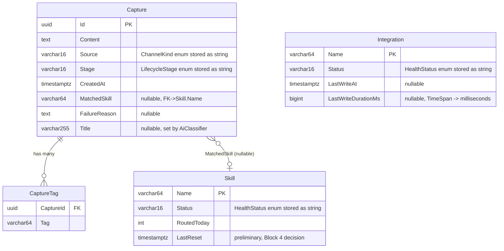

# FlowHub — DB Model Sketch (Block 4 preview)

- **Status:** Sketch — not implementation-ready
- **Date:** 2026-05-03
- **Block:** Block 3 (Services) — Nachbereitung · DB-model rubric deliverable
- **Lands as:** EF Core entities + migrations in `source/FlowHub.Persistence/` during Block 4 (PVA 2026-05-23)

This is a forward-looking sketch of the persistence model so Block 4 Vorbereitung can start from a target shape rather than greenfield discovery. The actual schema may diverge once concrete EF Core conventions land. **Do not implement directly from this document** — treat as a design starting point.

---

## ER overview

---

## Entity catalogue

### `Capture` (aggregate root)

| Column | Type | Constraints | Notes |
|---|---|---|---|
| Id | uuid | PK, generated by app | maps to `Guid Id` in `FlowHub.Core.Captures.Capture` |
| Content | text | NOT NULL | freeform; can be a URL, plain text, or note |
| Source | varchar(16) | NOT NULL, CHECK in ('Telegram','Web','Api') | `ChannelKind` persisted as string per `JsonStringEnumConverter` parity |
| Stage | varchar(16) | NOT NULL | `LifecycleStage` persisted as string; Raw/Classified/Routed/Completed/Orphan/Unhandled |
| CreatedAt | timestamptz | NOT NULL | UTC; maps to `DateTimeOffset CreatedAt` |
| MatchedSkill | varchar(64) | NULL, FK -> Skill.Name | set by classifier; null until Classified |
| FailureReason | text | NULL | populated on Orphan/Unhandled; truncate to 500 chars before write (ADR 0003 §"Open items") |
| Title | varchar(255) | NULL | populated by `AiClassifier` (Slice C); `KeywordClassifier` returns null |

### `Skill` (read/status snapshot)

| Column | Type | Constraints | Notes |
|---|---|---|---|
| Name | varchar(64) | PK | skill identifier, e.g. "Wallabag", "Vikunja" |
| Status | varchar(16) | NOT NULL | `HealthStatus` (Unknown/Healthy/Degraded/Down) stored as string |
| RoutedToday | int | NOT NULL, DEFAULT 0 | counter reset daily; reset strategy (cron vs event) is a Block 4 decision |
| LastReset | timestamptz | NULL | tracks when RoutedToday was last zeroed — preliminary, Block 4 decision |

### `Integration` (read/status snapshot)

| Column | Type | Constraints | Notes |
|---|---|---|---|
| Name | varchar(64) | PK | integration identifier, e.g. "Wallabag" |
| Status | varchar(16) | NOT NULL | `HealthStatus` stored as string |
| LastWriteAt | timestamptz | NULL | maps to `DateTimeOffset? LastWriteAt` |
| LastWriteDurationMs | bigint | NULL | `TimeSpan? LastWriteDuration` stored as milliseconds; reconstructed in app |

### `CaptureTag` (join table — Block 4 decision)

| Column | Type | Constraints | Notes |
|---|---|---|---|
| CaptureId | uuid | PK (composite), FK -> Capture.Id CASCADE DELETE | |
| Tag | varchar(64) | PK (composite) | normalized lowercase; source: `ClassificationResult.Tags` |

This join table is the straightforward option. The alternative — a `text[]` PostgreSQL array column on `Capture` — is simpler to query within a single row but less indexable. **Choice is deferred to Block 4.**

---

## Indexes (preliminary)

| Index | Column(s) | Rationale |
|---|---|---|
| `ix_capture_stage` | `Capture.Stage` | Dashboard "needs attention" queries filter on Orphan/Unhandled |
| `ix_capture_created_at_desc` | `Capture.CreatedAt DESC` | Recent-captures list; pagination cursor is `CreatedAt`-based |
| `ix_capture_matched_skill` | `Capture.MatchedSkill` | `RoutedToday` aggregation per skill; join to Skill table |
| `ix_capture_source` | `Capture.Source` | `GET /api/v1/captures?source=` filter (D4 in api-surface.md) |
| `ix_capture_tag_tag` | `CaptureTag.Tag` | Tag-based filtering if surfaced in Block 4/5 |

---

## Lifecycle states (recap)

| Stage | Meaning | Transitions to |
|---|---|---|
| Raw | just submitted | Classified (via `CaptureEnrichmentConsumer`) or Orphan |
| Classified | classifier returned skill match | Routed (via `SkillRoutingConsumer`) or Orphan |
| Routed | sent to skill integration (in-flight) | Completed (success) or Unhandled (failure) |
| Completed | terminal — integration write succeeded | — |
| Orphan | terminal — no skill match or classification failure | reassigned manually |
| Unhandled | terminal — integration exhausted retries | retried manually via `POST /api/v1/captures/{id}/retry` |

---

## What is deliberately deferred

- **Audit fields** (`UpdatedAt`, `Version` / `RowVersion` for optimistic concurrency) — Block 4
- **AI audit fields** (`AiProvider`, `AiModel`, `AiDurationMs`, `WasFallback`) per AI integration spec §"Block 4 (Persistence)" — Block 4; earns rubric points for documented test results
- **Tag storage strategy** — join table (`CaptureTag`) vs PostgreSQL `text[]` array column — Block 4 decision
- **`RoutedToday` reset mechanism** — scheduled cron job vs. event-driven vs. computed column — Block 4
- **Outbox pattern table** — `MassTransit.EntityFrameworkOutbox` integration deferred per ADR 0003 §"Outbox / Idempotency"
- **Idempotency receiver** — at-least-once redelivery guard (lookup by `CaptureId` before mutating) — ADR 0003 §"Open items"
- **Soft-delete / retention** — FlowHub is append-only; no delete in v1 (api-surface.md D6)
- **Full-text search** — `tsvector` column on `Content` if KI-Suche lands in Block 5

---

## References

- `source/FlowHub.Core/Captures/Capture.cs` — aggregate root (actual field list)
- `source/FlowHub.Core/Health/SkillHealth.cs`, `IntegrationHealth.cs` — health snapshot records
- `source/FlowHub.Core/Classification/ClassificationResult.cs` — Tags + MatchedSkill + Title
- `docs/design/api/api-surface.md` §"Data model (reminder, from FlowHub.Core)"
- ADR 0002 (`docs/adr/0002-service-architecture-and-async-communication.md`) — modular monolith, single DB
- ADR 0003 (`docs/adr/0003-async-pipeline.md`) — async pipeline, outbox deferral, FailureReason sanitization
- AI integration design spec (`docs/superpowers/specs/2026-05-03-slice-c-ai-integration-design.md`) §"Block 4 (Persistence)" — AI audit fields
