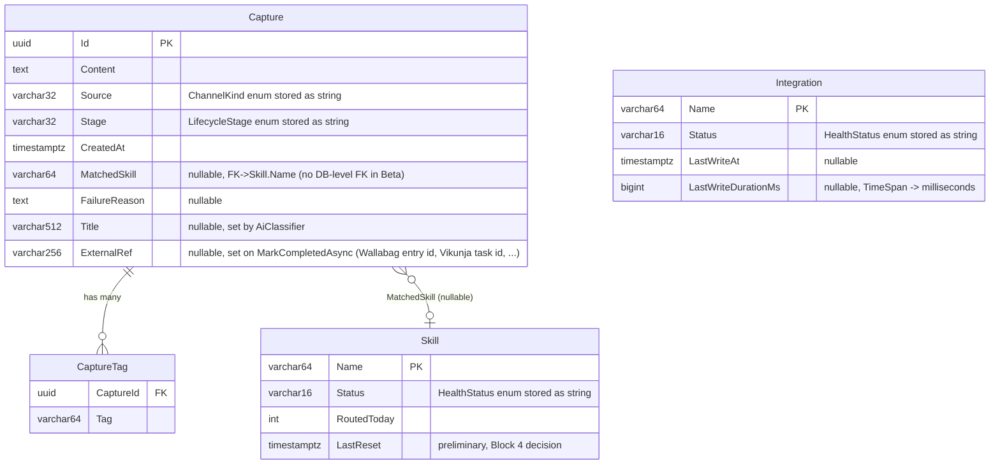

# FlowHub — DB Model Sketch (Block 4 preview)

- **Status:** Mixed — `Capture` shipped via Beta MVP (2026-05-04); `Skill`, `Integration`, `CaptureTag` remain sketches for Block 4
- **Date:** 2026-05-03 (initial sketch), 2026-05-04 (Beta MVP alignment)
- **Block:** Block 3 (Services) — Nachbereitung · DB-model rubric deliverable; carried into Block 4 (Persistence)
- **Lands as:** EF Core entities + migrations in `source/FlowHub.Persistence/`. `Capture` entity is live; remaining entities scheduled for Block 4 (PVA 2026-05-23).

This document was originally a forward-looking sketch authored during Block 3 Nachbereitung. The Beta MVP slice (`docs/superpowers/specs/2026-05-04-beta-mvp-design.md`, ADR 0005) landed the `Capture` aggregate ahead of the formal Block-4 phase, so the Capture-related rows below now reflect what actually shipped. Skill / Integration / CaptureTag rows remain design sketches and will be re-litigated in Block 4 — column types, lengths, and constraints may evolve before implementation.

> **Implementation status (2026-05-04):**
> - ✅ `Capture` — shipped as `CaptureEntity` in `source/FlowHub.Persistence/Entities/CaptureEntity.cs`, with EF Core configuration in `FlowHubDbContext.OnModelCreating`. Initial migration: `Migrations/20260504120638_Initial.cs`.
> - ⏳ `Skill`, `Integration`, `CaptureTag` — sketch only; Block 4 implementation pending.
> - 🚫 Outbox / idempotency receiver — explicitly deferred (ADR 0003 §"Open items"); not in Block 4 scope.

---

## ER overview

---

## Entity catalogue

### `Capture` (aggregate root) — ✅ shipped via Beta MVP

| Column | Type | Constraints | Notes |
|---|---|---|---|
| Id | uuid | PK, generated by app (`Guid.NewGuid()`) | maps to `Guid Id` in `FlowHub.Core.Captures.Capture` |
| Content | text | NOT NULL | freeform; can be a URL, plain text, or note |
| Source | varchar(32) | NOT NULL | `ChannelKind` persisted as enum-name string. EF Core does not generate CHECK constraints automatically; values are constrained by app code in `EfCaptureService.SubmitAsync` (`source.ToString()`) and `Enum.Parse<ChannelKind>` on read. Block 4 may add a CHECK on the PostgreSQL switch. |
| Stage | varchar(32) | NOT NULL | `LifecycleStage` persisted as enum-name string; Raw/Classified/Routed/Completed/Orphan/Unhandled. Same enum-string pattern as `Source`. |
| CreatedAt | timestamptz | NOT NULL | UTC; maps to `DateTimeOffset CreatedAt`. Set by `EfCaptureService.SubmitAsync` (`DateTimeOffset.UtcNow`). |
| MatchedSkill | varchar(64) | NULL | set by classifier; null until Classified. **No DB-level FK to `Skill.Name` in the Beta** — `Skill` table doesn't exist yet. App-level integrity only. |
| FailureReason | text | NULL | populated on Orphan/Unhandled. Truncation to 500 chars per ADR 0003 §"Open items" is applied at the `LifecycleFaultObserver` source, not at the column level. |
| Title | varchar(512) | NULL | populated by `AiClassifier` (Slice C); `KeywordClassifier` returns null. Length raised from initial 255-char sketch to 512 to accommodate longer AI-generated titles without an early hard cut. |
| ExternalRef | varchar(256) | NULL | set on `MarkCompletedAsync(externalRef)`. Stores the downstream system's identifier (Wallabag entry id `4711`, Vikunja task id `777`) so the Capture Detail page can later link back. Beta MVP wires this into the UI's Capture Detail Metadata. |

### `Skill` (read/status snapshot) — ⏳ sketch only, Block 4 implementation

| Column | Type | Constraints | Notes |
|---|---|---|---|
| Name | varchar(64) | PK | skill identifier, e.g. "Wallabag", "Vikunja" |
| Status | varchar(16) | NOT NULL | `HealthStatus` (Unknown/Healthy/Degraded/Down) stored as string |
| RoutedToday | int | NOT NULL, DEFAULT 0 | counter reset daily; reset strategy (cron vs event) is a Block 4 decision |
| LastReset | timestamptz | NULL | tracks when RoutedToday was last zeroed — preliminary, Block 4 decision |

### `Integration` (read/status snapshot) — ⏳ sketch only, Block 4 implementation

| Column | Type | Constraints | Notes |
|---|---|---|---|
| Name | varchar(64) | PK | integration identifier, e.g. "Wallabag" |
| Status | varchar(16) | NOT NULL | `HealthStatus` stored as string |
| LastWriteAt | timestamptz | NULL | maps to `DateTimeOffset? LastWriteAt` |
| LastWriteDurationMs | bigint | NULL | `TimeSpan? LastWriteDuration` stored as milliseconds; reconstructed in app |

### `CaptureTag` (join table — Block 4 decision) — ⏳ sketch only

| Column | Type | Constraints | Notes |
|---|---|---|---|
| CaptureId | uuid | PK (composite), FK -> Capture.Id CASCADE DELETE | |
| Tag | varchar(64) | PK (composite) | normalized lowercase; source: `ClassificationResult.Tags` |

This join table is the straightforward option. The alternative — a `text[]` PostgreSQL array column on `Capture` — is simpler to query within a single row but less indexable. **Choice is deferred to Block 4.**

---

## Indexes

### Shipped (Beta MVP)

| Index | Column(s) | Rationale |
|---|---|---|
| `IX_Captures_Stage` | `Capture.Stage` | Dashboard "needs attention" count + lifecycle filter chips on `/captures` |
| `IX_Captures_CreatedAt_DESC` | `Capture.CreatedAt DESC` | Recent-captures list + cursor pagination on `/captures` |

### Planned (Block 4)

| Index | Column(s) | Rationale |
|---|---|---|
| `ix_capture_matched_skill` | `Capture.MatchedSkill` | `RoutedToday` aggregation per skill; join to Skill table once Skill entity ships |
| `ix_capture_source` | `Capture.Source` | `GET /api/v1/captures?source=` filter (D4 in api-surface.md) |
| `ix_capture_tag_tag` | `CaptureTag.Tag` | Tag-based filtering if surfaced in Block 4/5; depends on `CaptureTag` join-table decision |

---

## Lifecycle states (recap)

| Stage | Meaning | Transitions to |
|---|---|---|
| Raw | just submitted | Classified (via `CaptureEnrichmentConsumer`) or Orphan |
| Classified | classifier returned skill match | Routed (via `SkillRoutingConsumer`) or Orphan |
| Routed | sent to skill integration (in-flight) | Completed (success) or Unhandled (failure) |
| Completed | terminal — integration write succeeded | — |
| Orphan | terminal — no skill match or classification failure | reassigned manually |
| Unhandled | terminal — integration exhausted retries | retried manually via `POST /api/v1/captures/{id}/retry` |

---

## What is deliberately deferred

- **Audit fields** (`UpdatedAt`, `Version` / `RowVersion` for optimistic concurrency) — Block 4
- **AI audit fields** (`AiProvider`, `AiModel`, `AiDurationMs`, `WasFallback`) per AI integration spec §"Block 4 (Persistence)" — Block 4; earns rubric points for documented test results
- **Tag storage strategy** — join table (`CaptureTag`) vs PostgreSQL `text[]` array column — Block 4 decision
- **`RoutedToday` reset mechanism** — scheduled cron job vs. event-driven vs. computed column — Block 4
- **Outbox pattern table** — `MassTransit.EntityFrameworkOutbox` integration deferred per ADR 0003 §"Outbox / Idempotency"
- **Idempotency receiver** — at-least-once redelivery guard (lookup by `CaptureId` before mutating) — ADR 0003 §"Open items"
- **Soft-delete / retention** — FlowHub is append-only; no delete in v1 (api-surface.md D6)
- **Full-text search** — `tsvector` column on `Content` if KI-Suche lands in Block 5

---

## References

- `source/FlowHub.Core/Captures/Capture.cs` — aggregate root (actual field list)
- `source/FlowHub.Persistence/Entities/CaptureEntity.cs` — shipped EF Core entity (Beta MVP, internal sealed)
- `source/FlowHub.Persistence/FlowHubDbContext.cs` — shipped DbContext + indexes
- `source/FlowHub.Persistence/Migrations/20260504120638_Initial.cs` — shipped initial migration
- ADR 0005 (`docs/adr/0005-persistence.md`) — Persistence ADR
- `source/FlowHub.Core/Health/SkillHealth.cs`, `IntegrationHealth.cs` — health snapshot records
- `source/FlowHub.Core/Classification/ClassificationResult.cs` — Tags + MatchedSkill + Title
- `docs/design/api/api-surface.md` §"Data model (reminder, from FlowHub.Core)"
- ADR 0002 (`docs/adr/0002-service-architecture-and-async-communication.md`) — modular monolith, single DB
- ADR 0003 (`docs/adr/0003-async-pipeline.md`) — async pipeline, outbox deferral, FailureReason sanitization
- AI integration design spec (`docs/superpowers/specs/2026-05-03-slice-c-ai-integration-design.md`) §"Block 4 (Persistence)" — AI audit fields
