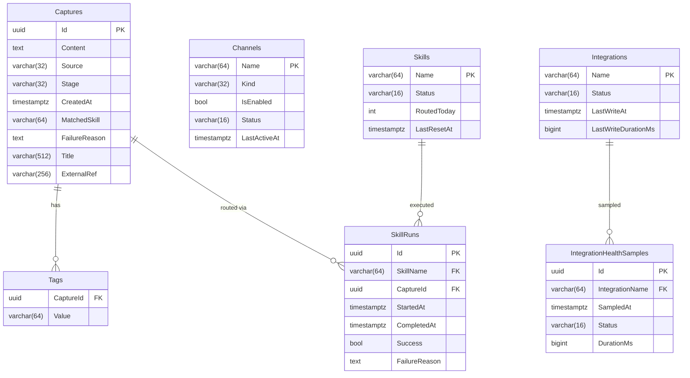

# FlowHub Entity-Relationship Diagram — Block 4 Schema

## FK Strategy

| Relationship | Type | Reason |
|---|---|---|
| Capture.Source → Channel.Name | **Soft** (no DB FK) | Channels can be deregistered without orphan failures |
| Capture.MatchedSkill → Skill.Name | **Soft** (no DB FK) | Consistent with Beta MVP pattern |
| SkillRun.SkillName → Skill.Name | **Hard** (RESTRICT) | SkillRun is audit trail; Skill must exist |
| SkillRun.CaptureId → Capture.Id | **Hard** (CASCADE) | Run is meaningless without its Capture |
| IntegrationHealthSample.IntegrationName → Integration.Name | **Hard** (CASCADE) | Sample is meaningless without its Integration |
| Tag.CaptureId → Capture.Id | **Hard** (CASCADE) | Tag is owned by Capture |
