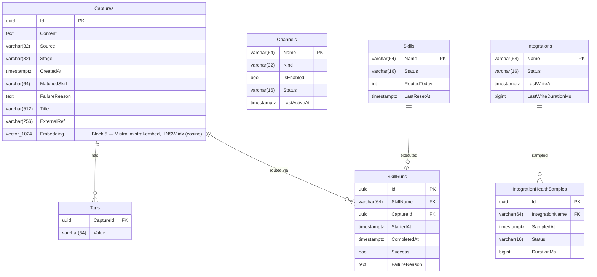

# FlowHub Entity-Relationship Diagram

> **Schema lineage:** Block 4 introduced the base relational model (Captures, Channels, Skills, SkillRuns, Integrations, IntegrationHealthSamples, Tags). Block 5 added the pgvector `Embedding` column on Captures and the HNSW index for semantic search (migration `0004_AddEmbedding`).

## FK Strategy

| Relationship | Type | Reason |
|---|---|---|
| Capture.Source → Channel.Name | **Soft** (no DB FK) | Channels can be deregistered without orphan failures |
| Capture.MatchedSkill → Skill.Name | **Soft** (no DB FK) | Consistent with Beta MVP pattern |
| SkillRun.SkillName → Skill.Name | **Hard** (RESTRICT) | SkillRun is audit trail; Skill must exist |
| SkillRun.CaptureId → Capture.Id | **Hard** (CASCADE) | Run is meaningless without its Capture |
| IntegrationHealthSample.IntegrationName → Integration.Name | **Hard** (CASCADE) | Sample is meaningless without its Integration |
| Tag.CaptureId → Capture.Id | **Hard** (CASCADE) | Tag is owned by Capture |

## Delete Strategy

FlowHub uses **hard delete** for owned entities (via the FK CASCADE rules in the table above). There is no `IsDeleted` column or query filter.

Soft-delete semantics are carried by `LifecycleStage` instead:

| Concern | Mechanism |
|---|---|
| "Failed Capture I might retry" | `LifecycleStage.Orphan` + `FailureReason` — Capture stays in the table, surfaces in the Dashboard "Needs Attention" widget, retryable via `POST /api/v1/captures/{id}/retry`. |
| "Capture didn't match any skill" | `LifecycleStage.Unhandled` — same persistence story, different operator action (Assign Skill). |
| "Capture done" | `LifecycleStage.Completed` — terminal, stays for history. |
| "I actually want this row gone" | `DELETE` via API or direct SQL — CASCADE removes Tags + SkillRuns; SkillRuns retain audit value but only for the lifetime of the Capture they describe. |

This is a deliberate Block-4 decision (ADR 0005 §6 area): the operational concerns soft-delete usually solves (retry, hide, undo) are already covered by the lifecycle state machine, so an `IsDeleted` flag would be ceremony without benefit. If a future requirement needs "undelete" of a hard-deleted Capture, soft-delete can be reintroduced as a column without breaking the existing API.

## Vector Search (Block 5)

| Column | Type | Index | Notes |
|---|---|---|---|
| `Captures.Embedding` | `vector(1024)` (pgvector) | `captures_embedding_hnsw_idx` (HNSW, `vector_cosine_ops`) | Populated asynchronously by `CaptureEmbeddingConsumer` via Mistral `mistral-embed`. Nullable — captures without an embedding fall back to keyword search. |
