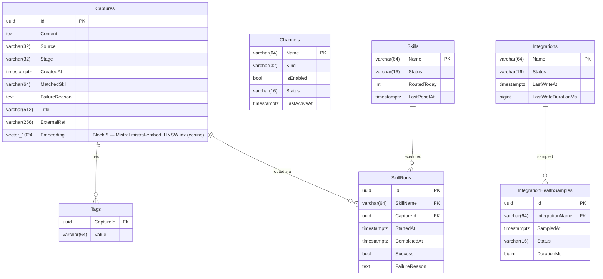

# FlowHub Entity-Relationship Diagram

> **Schema lineage:** Block 4 introduced the base relational model (Captures, Channels, Skills, SkillRuns, Integrations, IntegrationHealthSamples, Tags). Block 5 added the pgvector `Embedding` column on Captures and the HNSW index for semantic search (migration `0004_AddEmbedding`).



## Legende

The diagram is a Mermaid `erDiagram` (Chen-style entity-relationship). Read it together with the FK Strategy table below — soft FKs are deliberately **not drawn** because they have no DB-level constraint.

| Symbol / column marker | Meaning |
|---|---|
| `Entity { … }` | Database table. Box title is the table name (always plural in this schema). |
| `type Field PK` | Column belonging to the primary key. Composite PKs list every member with `PK`. |
| `type Field FK` | Column carrying a **hard** foreign-key constraint (enforced by PostgreSQL). |
| `type Field` (no marker) | Regular column. For soft references (`Capture.Source`, `Capture.MatchedSkill`), this is intentional — see FK Strategy below. |
| `"…"` after a column | Inline note (e.g., the Block-5 `Embedding` column carries its provider note here). |
| `A ||--o{ B : "verb"` | One-to-many relationship from `A` to `B`. The verb labels the relationship from `A`'s side ("Capture *has* Tags"). |
| ` ` ` | one-and-only-one cardinality on `A`'s side. |
| `o{` | zero-or-more cardinality on `B`'s side. |
| (no line drawn) | Soft reference — application-level only, no DB FK. Listed only in the FK Strategy table. |

`varchar(N)`, `text`, `uuid`, `timestamptz`, `bool`, `bigint`, `vector(N)` are PostgreSQL types; `int` reads as `int4`.

## FK Strategy

| Relationship | Type | Reason |
|---|---|---|
| Capture.Source → Channel.Name | **Soft** (no DB FK) | Channels can be deregistered without orphan failures |
| Capture.MatchedSkill → Skill.Name | **Soft** (no DB FK) | Consistent with Beta MVP pattern |
| SkillRun.SkillName → Skill.Name | **Hard** (RESTRICT) | SkillRun is audit trail; Skill must exist |
| SkillRun.CaptureId → Capture.Id | **Hard** (CASCADE) | Run is meaningless without its Capture |
| IntegrationHealthSample.IntegrationName → Integration.Name | **Hard** (CASCADE) | Sample is meaningless without its Integration |
| Tag.CaptureId → Capture.Id | **Hard** (CASCADE) | Tag is owned by Capture |

## Delete Strategy

FlowHub uses **hard delete** for owned entities (via the FK CASCADE rules in the table above). There is no `IsDeleted` column or query filter.

Soft-delete semantics are carried by `LifecycleStage` instead:

| Concern | Mechanism |
|---|---|
| "Failed Capture I might retry" | `LifecycleStage.Orphan` + `FailureReason` — Capture stays in the table, surfaces in the Dashboard "Needs Attention" widget, retryable via `POST /api/v1/captures/{id}/retry`. |
| "Capture didn't match any skill" | `LifecycleStage.Unhandled` — same persistence story, different operator action (Assign Skill). |
| "Capture done" | `LifecycleStage.Completed` — terminal, stays for history. |
| "I actually want this row gone" | `DELETE` via API or direct SQL — CASCADE removes Tags + SkillRuns; SkillRuns retain audit value but only for the lifetime of the Capture they describe. |

This is a deliberate Block-4 decision (ADR 0005 §6 area): the operational concerns soft-delete usually solves (retry, hide, undo) are already covered by the lifecycle state machine, so an `IsDeleted` flag would be ceremony without benefit. If a future requirement needs "undelete" of a hard-deleted Capture, soft-delete can be reintroduced as a column without breaking the existing API.

## Vector Search (Block 5)

| Column | Type | Index | Notes |
|---|---|---|---|
| `Captures.Embedding` | `vector(384)` (pgvector) | `captures_embedding_hnsw_idx` (HNSW, `vector_cosine_ops`) | Populated asynchronously by `CaptureEmbeddingConsumer`; sized for a **multilingual-e5-small**-class embedder (as-built default). `mistral-embed` (1024-dim) is a documented swap. Nullable — captures without an embedding fall back to keyword search. |

## Migrations

The schema is evolved exclusively through EF Core migrations (14 to date,
`Migrations/20260506194548_0001_Initial.cs` … `…_0013_ResizeEmbeddingTo384.cs`),
applied migrations-first by the `flowhub.migrations` init job — never via
`EnsureCreated`/auto-migrate at runtime (ADR 0005). Representative script — the
Block-5 pgvector migration that introduced the embedding column + HNSW index
(`Migrations/20260507115906_0004_AddEmbedding.cs`; the column was later resized
from `vector(1024)` to the as-built `vector(384)` by
`…_0013_ResizeEmbeddingTo384.cs`, matching the multilingual-e5-small embedder):

```csharp
protected override void Up(MigrationBuilder migrationBuilder)
{
    migrationBuilder.AlterDatabase()
        .Annotation("Npgsql:PostgresExtension:vector", ",,");

    migrationBuilder.AddColumn<Vector>(
        name: "Embedding", table: "Captures",
        type: "vector(1024)", nullable: true);

    migrationBuilder.Sql("""
        CREATE INDEX IF NOT EXISTS captures_embedding_hnsw_idx
        ON "Captures" USING hnsw ("Embedding" vector_cosine_ops);
        """);
}

protected override void Down(MigrationBuilder migrationBuilder)
{
    migrationBuilder.Sql("""DROP INDEX IF EXISTS captures_embedding_hnsw_idx;""");
    migrationBuilder.DropColumn(name: "Embedding", table: "Captures");
    migrationBuilder.AlterDatabase()
        .OldAnnotation("Npgsql:PostgresExtension:vector", ",,");
}
```
