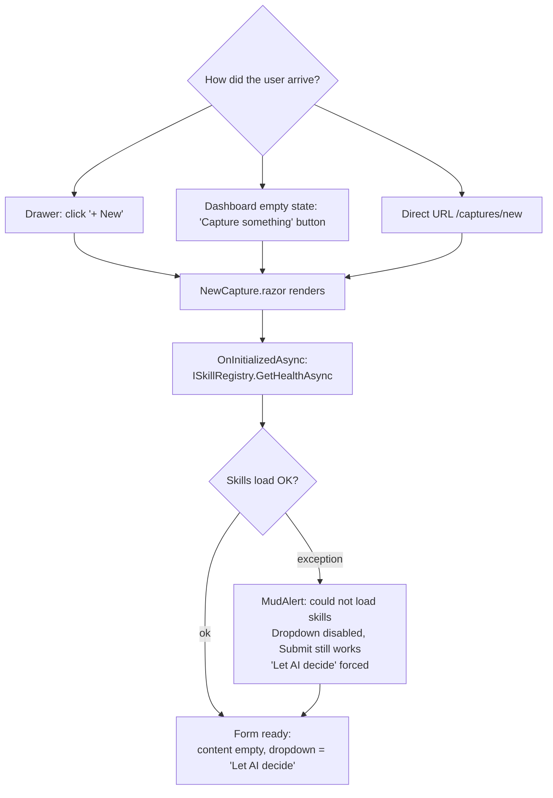
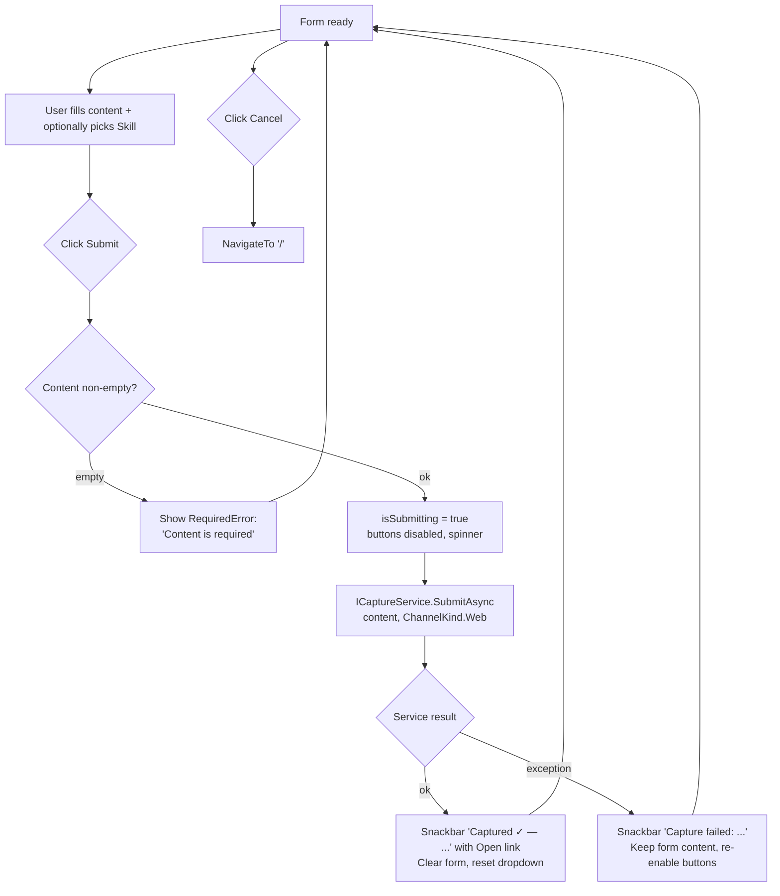
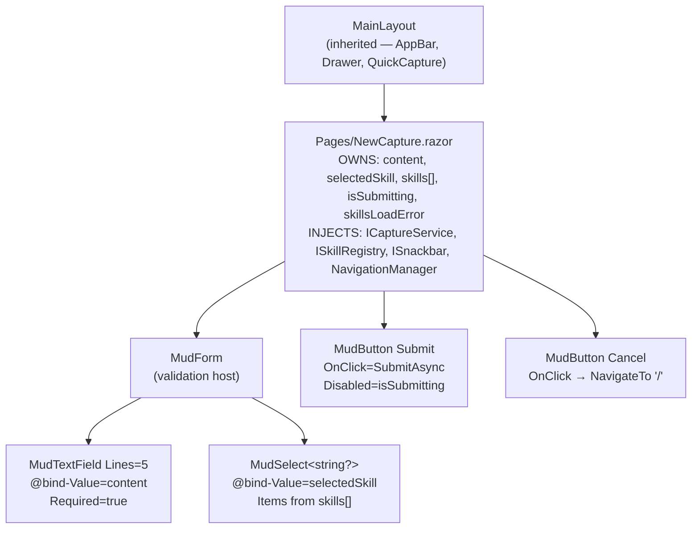

# New Capture — Flow Diagrams (Phase 2)

- **Page route:** `/captures/new`
- **Render mode:** Interactive Server (per ADR 0001)
- **Status:** Approved 2026-04-10
- **Phase:** 2 of 4 (`/ui-flow`)
- **Predecessor:** [`wireframe.md`](./wireframe.md)
- **Next phase:** `/ui-build` — Razor component implementation

## Diagram 1a — Entry & skill loading

## Diagram 1b — Form interaction & submit loop

Two diagrams, 12 and 13 nodes. Together they cover: all 3 entry points, skill-load failure, validation, submit success (clear + stay for rapid multi-entry), submit failure (keep content), and cancel exit.

## Diagram 2 — Component hierarchy & state ownership

### State & data flow

| Component | Owns | Receives | Calls | Notes |
|---|---|---|---|---|
| `NewCapture` | `content`, `selectedSkill`, `skills[]`, `isSubmitting`, `skillsLoadError` | — | `ISkillRegistry.GetHealthAsync`, `ICaptureService.SubmitAsync`, `ISnackbar.Add`, `NavigationManager.NavigateTo` | Single owner of all state — no child components, no EventCallbacks needed |
| `MudForm` | validation state | — | — | Validates `MudTextField.Required` on submit; `NewCapture` calls `form.Validate()` before proceeding |
| `MudTextField` | — | `@bind-Value=content` | — | Two-way binding, no service calls |
| `MudSelect<string?>` | — | `@bind-Value=selectedSkill`, items from `skills[]` | — | Two-way binding, null = "Let AI decide" |

**Key difference from Dashboard:** `NewCapture` is a **flat page** — no child card components, no EventCallbacks, no props-down. The `MudForm`, `MudTextField`, and `MudSelect` are MudBlazor built-ins composed inline. The page owns everything directly.

## Implied surfaces

| # | Surface | Already exists? | Action needed |
|---|---|---|---|
| 1 | `MudSnackbar` for success/error feedback | Yes — `MudSnackbarProvider` in `MainLayout` | None |
| 2 | Snackbar "Open" action navigates to `/captures/{id}` | Yes — stub page exists | None |

**No new pages, no new dialogs, no new shared components implied.**

## Deliberately not in scope

- No `MudDialog` confirmation — submitting a Capture is not destructive.
- No draft/autosave — two fields; lost state is trivial to re-enter.
- No image/file upload — deferred per wireframe scope (option B).
- No inline preview of classification — nice-to-have for a later block.
