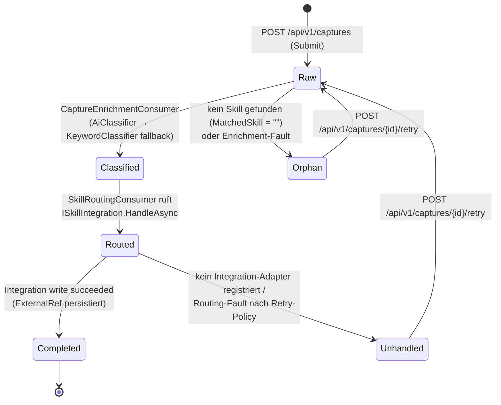
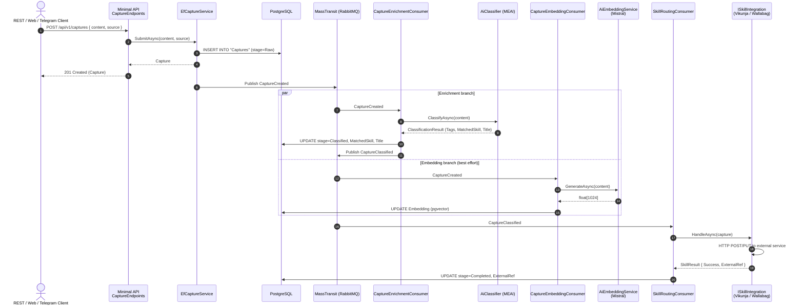

# FlowHub Architecture — Three Perspectives

This document maps FlowHub's architecture to the three classical perspectives required by the CAS AISE rubric (*Struktur · Verhalten · Interaktion*) and points to the canonical artefact for each.

| Perspective | Question it answers | Canonical artefacts |
|---|---|---|
| **Struktur** (Structure) | *Welche Bausteine gibt es und wie sind sie geschichtet?* | Modular monolith layout, layered modules, deployment topology |
| **Verhalten** (Behaviour) | *Wie verändert sich der Zustand der zentralen Domänenobjekte über die Zeit?* | Capture lifecycle state machine, MassTransit retry semantics |
| **Interaktion** (Interaction) | *Wie spielen die Bausteine zur Laufzeit zusammen?* | End-to-end sequence flows, API contracts, async pipeline traces |

---

## 1. Struktur (Structure)

**One sentence:** FlowHub is a flat-layout **Modular Monolith** in .NET 10 (per ADR 0001) deployed as six independent containers under docker-compose (per ADR 0002).

### Module map

```
source/
├── FlowHub.Core/          ← domain types + driving ports (Capture, Skill, Health, IClassifier, IEmbeddingService, ISkillIntegration)
├── FlowHub.Web/           ← Blazor Web App (Interactive Server, MudBlazor) + MassTransit consumers + Minimal API host
├── FlowHub.Api/           ← Minimal API endpoint definitions (CaptureEndpoints, SearchEndpoints, AdminEndpoints)
├── FlowHub.AI/            ← AiClassifier + AiEmbeddingService over Microsoft.Extensions.AI
├── FlowHub.Persistence/   ← EF Core + PostgreSQL + pgvector adapter for ICaptureRepository
└── FlowHub.Skills/        ← Wallabag + Vikunja ISkillIntegration adapters
```

> The six projects above are the complete solution (`FlowHub.slnx`). A Telegram
> channel and a generic integrations layer are planned but not yet scaffolded.

### Deployment topology (`docker-compose.yml`)

```
┌───────────────┐     ┌──────────────────┐     ┌────────────┐
│ flowhub.web   │────▶│ rabbitmq         │     │ prometheus │◀── /metrics scrape
│ (Blazor +     │     │ (in-process bus  │     └────────────┘
│  Minimal API) │     │  fallback when   │     ┌────────────┐
│               │     │  Bus__Transport= │     │ grafana    │
│               │     │  RabbitMq)       │     └────────────┘
└──────┬────────┘     └──────────────────┘
       │
       ▼
┌───────────────┐     ┌──────────────────┐
│ postgres      │◀────│ flowhub.         │
│ (+ pgvector)  │     │ migrations       │
│               │     │ (init container, │
│               │     │  efbundle, 12-F  │
│               │     │  XII)            │
└───────────────┘     └──────────────────┘
```

### References

- ADR 0001 — Frontend Render Mode & Architecture (Q1 = flat layout)
- `docs/projektbeschreibung/FlowHub_Architecture-v2.svg` — bildliche Architektur
- `docs/projektbeschreibung/FlowHub_Projektbeschreibung_v4.md` §6 — Systemarchitektur (Überblick + Hybrid Skill-System)

---

## 2. Verhalten (Behaviour)

**One sentence:** Every Capture moves through a six-state lifecycle driven by the async pipeline (per ADR 0003), with explicit terminal states for happy-path success, retryable failure, and "no matching skill" outcomes.

### Capture lifecycle state machine



| Stage | Bedeutung | Eingang | Ausgang |
|---|---|---|---|
| `Raw` | Just arrived, no classification yet | Submit / Retry | → Classified, → Orphan |
| `Classified` | AI/Keyword has assigned a target skill | CaptureEnrichmentConsumer | → Routed |
| `Routed` | Skill processing in flight | SkillRoutingConsumer dispatched | → Completed, → Unhandled |
| `Completed` | Happy terminal state — write succeeded, `ExternalRef` set | Integration write returned 2xx | terminal |
| `Orphan` | No matching skill found, or enrichment failed (retryable) | Classifier returned `""` for `MatchedSkill`, or `Fault<CaptureCreated>` → `MarkOrphanAsync` | → Raw via Retry |
| `Unhandled` | Skill assigned but not routed: no integration adapter registered, or routing failed (retryable) | Routing sets directly, or `Fault<CaptureClassified>` → `MarkUnhandledAsync` | → Raw via Retry |

### Retry / error semantics

- **Per-consumer retry** (ADR 0003): `CaptureEnrichmentConsumer` retries with intervals `[100ms, 500ms]`. `CaptureEmbeddingConsumer` + `SkillRoutingConsumer` retry with `[500ms, 2s, 5s]`.
- **Fault observer**: `LifecycleFaultObserver` maps each fault to the matching terminal stage with a `FailureReason` — `Fault<CaptureCreated>` (enrichment) → `MarkOrphanAsync`, `Fault<CaptureClassified>` (routing) → `MarkUnhandledAsync`. No retry on the fault itself (would loop).
- **Embedding pipeline is best-effort**: `AiEmbeddingService` catches provider errors and stores the Capture without an embedding (search degrades to non-vector path).

### References

- ADR 0003 — Async Pipeline (MassTransit)
- `source/FlowHub.Core/Captures/LifecycleStage.cs` — enum definition
- `source/FlowHub.Web/Pipeline/` — consumer implementations
- `docs/spec/use-cases.md` UC-09, UC-10, UC-11 — lifecycle transitions described as user flows

---

## 3. Interaktion (Interaction)

**One sentence:** External actors interact with FlowHub through three channels (Web UI, Telegram bot, REST API); internally, every Capture traverses an async event-driven pipeline whose events are observable via OpenTelemetry traces and Prometheus metrics.

### Hot-path sequence — Submit Capture via REST → Skill write



### API surface

| Channel | Endpoint / mechanism | Documented in |
|---|---|---|
| REST | `POST /api/v1/captures` + `GET /api/v1/captures{,/{id},/search}` + retry / admin | OpenAPI doc at `/openapi/v1.json`, Scalar UI at `/scalar`, Bruno collection in `bruno/` |
| Web UI | Blazor Interactive Server pages (`/`, `/captures`, `/captures/{id}`, `/skills`, `/integrations`) | `source/FlowHub.Web/Components/Pages/`, design wireframes in `docs/design/<feature>/` |
| Telegram | Bot polling via long-poll loop (placeholder Channel in current build) | `vault/Projektarbeit/External Services.md` |
| Operations | `/health/live`, `/metrics` (Prometheus), Grafana dashboards | `docs/spec/nfa.md` NfA-D3, NfA-O1 |

### Observability

- **Traces:** OpenTelemetry ASP.NET Core + runtime instrumentation; MEAI chat/embedding spans (`UseOpenTelemetry()` on the IChatClient).
- **Metrics:** Prometheus scrape at `/metrics` — `dotnet_*` + `http_*` series verified by `just smoke-prod` step [4/6].
- **Logs:** Structured Serilog → stdout (12-Factor XI); event IDs in `source/FlowHub.*/` LoggerMessage attributes.

### References

- ADR 0002 — Service Architecture & Async Communication
- ADR 0003 — Async Pipeline (MassTransit)
- ADR 0004 — AI Integration in Services
- `docs/design/capture-detail/` — sequence diagrams for the Capture Detail flow
- `bruno/` — runnable REST request collection (one `.bru` per endpoint)
