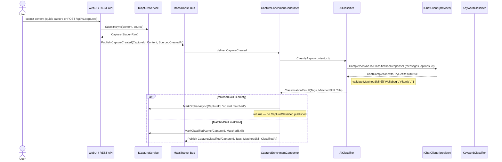
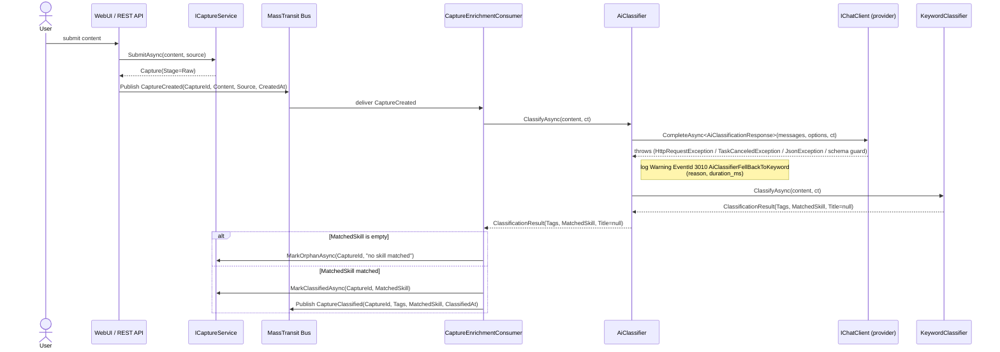

# Sequence Diagrams — Capture Enrichment

These diagrams document the behaviour of `CaptureEnrichmentConsumer` and the `IClassifier` port.
The consumer sits at the head of the MassTransit pipeline: it receives every `CaptureCreated` event
and turns it into a classified capture (happy path) or a terminal `Orphan` state (failure paths).

**Current implementation (Slice B):** `IClassifier` is `KeywordClassifier` — a deterministic,
in-process classifier. Slice C swaps in `AiClassifier : IClassifier` without touching any consumer
code; the port shape (`ClassifyAsync(content, ct) → ClassificationResult`) is unchanged.
The fallback diagram (B) therefore documents the *designed* Slice-C behaviour; it is not yet live.

---

## A. Happy path — AI classifier configured, call succeeds

The `AiClassifier` makes one structured-output call to the provider, validates the schema, and
returns a `ClassificationResult(Tags, MatchedSkill, Title)`. The consumer writes the result back
to `ICaptureService` and publishes `CaptureClassified` for the routing consumer.

**Invariants:**
- `MatchedSkill` is validated against `{"Wallabag", "Vikunja", ""}` even after a successful AI
  call — the schema constrains it, but the code also checks defensively.
- `Title` is populated only by `AiClassifier`; `KeywordClassifier` always returns `Title = null`.
- An empty `MatchedSkill` (no skill matched) is a *valid* outcome that skips `CaptureClassified`
  and goes straight to `MarkOrphanAsync` — no exception is raised.

---

## B. AI fallback path — provider call fails, KeywordClassifier floor activates

Any exception from `IChatClient` (network, timeout, JSON parse, or schema-violation guard) is
caught inside `AiClassifier`. The adapter logs the failure at `Warning` level and delegates to
`KeywordClassifier` as a hard floor. The consumer sees a valid `ClassificationResult` in both
cases — it never receives an exception from the classifier port.

**Invariants:**
- The fallback never rethrows — AI outage degrades classification quality, not availability.
- `Title` is always `null` in the fallback result; the capture reaches `Classified` stage without
  a generated title.
- The MassTransit retry budget (`Intervals(100, 500)`) is reserved for bus/infrastructure failures,
  not AI call failures — AI errors are handled inside `AiClassifier` before returning.
- The fault-observer path (`Fault<CaptureCreated>`) is not triggered by AI failures.

