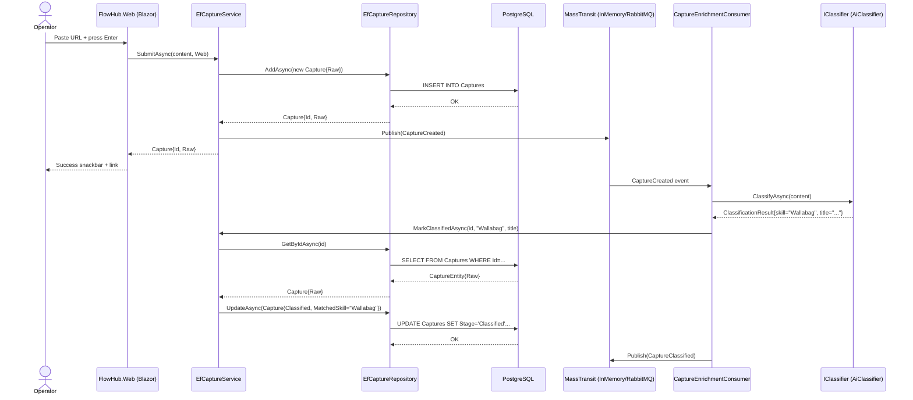

# Capture Intake — Sequence Diagram (Verhalten)

```mermaid
sequenceDiagram
    actor Operator
    participant UI as FlowHub.Web (Blazor)
    participant SVC as EfCaptureService
    participant REPO as EfCaptureRepository
    participant DB as PostgreSQL
    participant BUS as MassTransit (InMemory/RabbitMQ)
    participant ENRICH as CaptureEnrichmentConsumer
    participant AI as IClassifier (AiClassifier)

    Operator->>UI: Paste URL + press Enter
    UI->>SVC: SubmitAsync(content, Web)
    SVC->>REPO: AddAsync(new Capture{Raw})
    REPO->>DB: INSERT INTO Captures
    DB-->>REPO: OK
    REPO-->>SVC: Capture{Id, Raw}
    SVC->>BUS: Publish(CaptureCreated)
    SVC-->>UI: Capture{Id, Raw}
    UI-->>Operator: Success snackbar + link

    BUS->>ENRICH: CaptureCreated event
    ENRICH->>AI: ClassifyAsync(content)
    AI-->>ENRICH: ClassificationResult{skill="Wallabag", title="..."}
    ENRICH->>SVC: MarkClassifiedAsync(id, "Wallabag", title)
    SVC->>REPO: GetByIdAsync(id)
    REPO->>DB: SELECT FROM Captures WHERE Id=...
    DB-->>REPO: CaptureEntity{Raw}
    REPO-->>SVC: Capture{Raw}
    SVC->>REPO: UpdateAsync(Capture{Classified, MatchedSkill="Wallabag"})
    REPO->>DB: UPDATE Captures SET Stage='Classified'...
    DB-->>REPO: OK
    ENRICH->>BUS: Publish(CaptureClassified)
```
