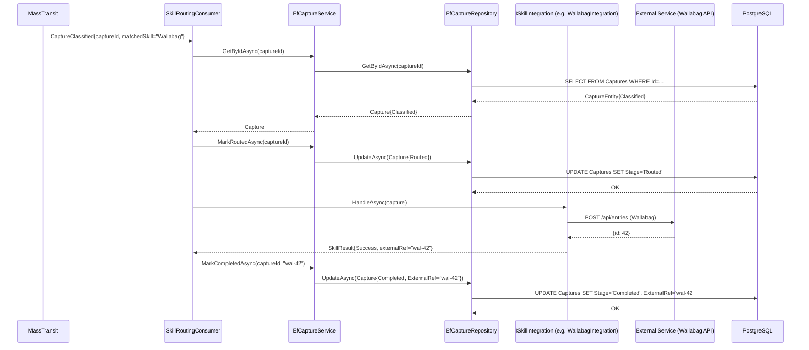

# Skill Routing Hot Path — Sequence Diagram (Verhalten + Interaktion)

```mermaid
sequenceDiagram
    participant BUS as MassTransit
    participant ROUTE as SkillRoutingConsumer
    participant SRVC as EfCaptureService
    participant SREPO as EfCaptureRepository
    participant SKILL as ISkillIntegration (e.g. WallabagIntegration)
    participant EXT as External Service (Wallabag API)
    participant DB as PostgreSQL

    BUS->>ROUTE: CaptureClassified{captureId, matchedSkill="Wallabag"}
    ROUTE->>SRVC: GetByIdAsync(captureId)
    SRVC->>SREPO: GetByIdAsync(captureId)
    SREPO->>DB: SELECT FROM Captures WHERE Id=...
    DB-->>SREPO: CaptureEntity{Classified}
    SREPO-->>SRVC: Capture{Classified}
    SRVC-->>ROUTE: Capture

    ROUTE->>SRVC: MarkRoutedAsync(captureId)
    SRVC->>SREPO: UpdateAsync(Capture{Routed})
    SREPO->>DB: UPDATE Captures SET Stage='Routed'
    DB-->>SREPO: OK

    ROUTE->>SKILL: HandleAsync(capture)
    SKILL->>EXT: POST /api/entries (Wallabag)
    EXT-->>SKILL: {id: 42}
    SKILL-->>ROUTE: SkillResult{Success, externalRef="wal-42"}

    ROUTE->>SRVC: MarkCompletedAsync(captureId, "wal-42")
    SRVC->>SREPO: UpdateAsync(Capture{Completed, ExternalRef="wal-42"})
    SREPO->>DB: UPDATE Captures SET Stage='Completed', ExternalRef='wal-42'
    DB-->>SREPO: OK
```
