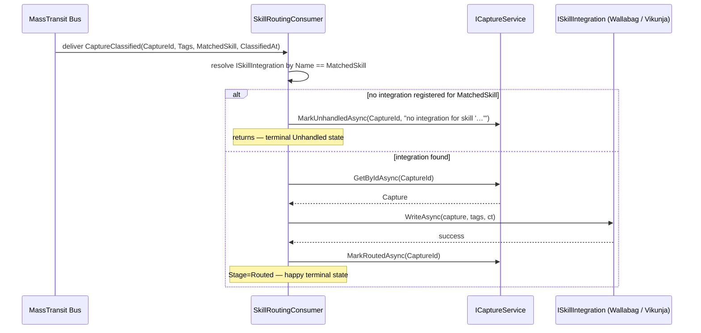
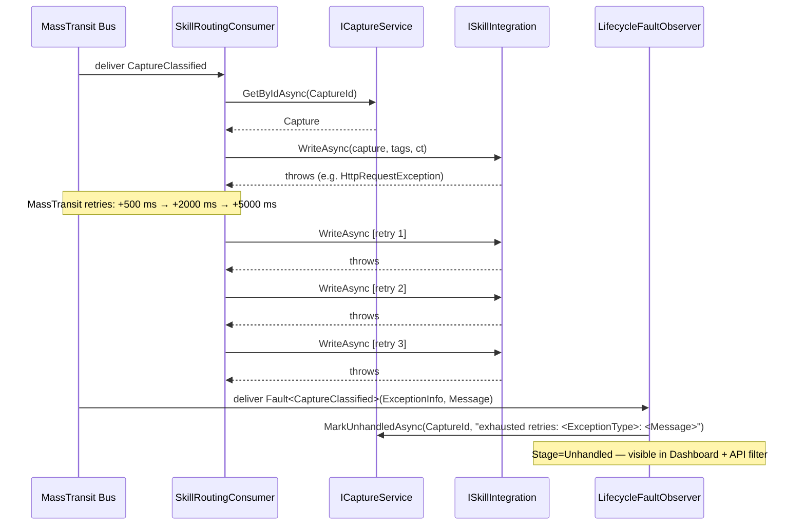

# Sequence Diagrams — Skill Routing

These diagrams document the behaviour of `SkillRoutingConsumer` and its retry / fault-observer
path. The consumer is the second hop in the MassTransit pipeline: it receives `CaptureClassified`
events and dispatches each capture to the matching `ISkillIntegration` adapter.

**Current implementation (Slice B):** `ISkillIntegration` is fulfilled by `LoggingSkillIntegration`
stubs (one registered as `"Wallabag"`, one as `"Vikunja"`). Each stub logs the write intent and
returns successfully. Real HTTP adapters replace the stubs in Block 4/5 without any consumer
changes.

**Retry policy:** `Intervals(500, 2000, 5000)` — three retries at 500 ms, 2 s, and 5 s. The
longer intervals reflect the anticipated latency of outbound HTTP calls to real integrations in
later blocks.

---

## A. Happy path — integration registered, write succeeds

The consumer resolves `ISkillIntegration` by name from the DI-registered collection, calls
`WriteAsync`, and marks the capture as `Routed`. There is no separate `Completed` transition in
the current consumer code — `Routed` is the happy terminal state written by the routing consumer.

**Invariants:**
- Resolution is by exact, ordinal string equality on `ISkillIntegration.Name`.
- If no integration matches the `MatchedSkill` (e.g. a skill registered in the classifier but
  not yet wired as an adapter), the capture is marked `Unhandled` directly — this is a
  *synchronous* terminal path, not a fault-observer path.
- `GetByIdAsync` throws `InvalidOperationException` if the capture is missing from the store;
  this is treated as a pipeline bug and will exhaust the retry budget before faulting.

---

## B. Retry exhaustion path — integration call keeps failing

When `WriteAsync` throws on every attempt, MassTransit exhausts the per-consumer retry budget
(`Intervals(500, 2000, 5000)`) and publishes a `Fault<CaptureClassified>` event.
`LifecycleFaultObserver` (which implements `IConsumer<Fault<CaptureClassified>>`) receives this
event and marks the capture as `Unhandled` with a formatted reason string extracted from the
first exception in `Fault.Exceptions`.

**Invariants:**
- `LifecycleFaultObserver` is best-effort: if `MarkUnhandledAsync` itself throws, the error is
  swallowed (logged at `Error`, `EventId 1003`) so the observer does not recurse into
  `Fault<Fault<T>>`. Cancellation (`OperationCanceledException`) still propagates.
- The observer is registered with *no retry policy* — recursive retry on a fault observer would
  loop forever.
- `Stage=Unhandled` surfaces in the Dashboard's "needs attention" tile and is queryable via
  `GET /api/v1/captures?stage=Unhandled`.
- A stuck `Unhandled` capture can be re-queued from that state via
  `POST /api/v1/captures/{id}/retry`, which re-publishes `CaptureCreated` and resets the
  lifecycle to `Raw`.

