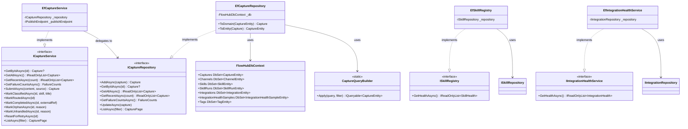

# FlowHub — Class Diagram (Struktur)

```mermaid
classDiagram
    class ICaptureService {
        <<interface>>
        +GetByIdAsync(id) Capture?
        +GetAllAsync() IReadOnlyList~Capture~
        +GetRecentAsync(count) IReadOnlyList~Capture~
        +GetFailureCountsAsync() FailureCounts
        +SubmitAsync(content, source) Capture
        +MarkClassifiedAsync(id, skill, title)
        +MarkRoutedAsync(id)
        +MarkCompletedAsync(id, externalRef)
        +MarkOrphanAsync(id, reason)
        +MarkUnhandledAsync(id, reason)
        +ResetForRetryAsync(id)
        +ListAsync(filter) CapturePage
    }

    class ICaptureRepository {
        <<interface>>
        +AddAsync(capture) Capture
        +GetByIdAsync(id) Capture?
        +GetAllAsync() IReadOnlyList~Capture~
        +GetRecentAsync(count) IReadOnlyList~Capture~
        +GetFailureCountsAsync() FailureCounts
        +UpdateAsync(capture)
        +ListAsync(filter) CapturePage
    }

    class ISkillRegistry {
        <<interface>>
        +GetHealthAsync() IReadOnlyList~SkillHealth~
    }

    class IIntegrationHealthService {
        <<interface>>
        +GetHealthAsync() IReadOnlyList~IntegrationHealth~
    }

    class EfCaptureService {
        -ICaptureRepository _repository
        -IPublishEndpoint _publishEndpoint
    }

    class EfCaptureRepository {
        -FlowHubDbContext _db
        +ToDomain(CaptureEntity) Capture
        +ToEntity(Capture) CaptureEntity
    }

    class EfSkillRegistry {
        -ISkillRepository _repository
    }

    class EfIntegrationHealthService {
        -IIntegrationRepository _repository
    }

    class FlowHubDbContext {
        +Captures DbSet~CaptureEntity~
        +Channels DbSet~ChannelEntity~
        +Skills DbSet~SkillEntity~
        +SkillRuns DbSet~SkillRunEntity~
        +Integrations DbSet~IntegrationEntity~
        +IntegrationHealthSamples DbSet~IntegrationHealthSampleEntity~
        +Tags DbSet~TagEntity~
    }

    class CaptureQueryBuilder {
        <<static>>
        +Apply(query, filter) IQueryable~CaptureEntity~
    }

    EfCaptureService ..|> ICaptureService : implements
    EfCaptureService --> ICaptureRepository : delegates to
    EfCaptureRepository ..|> ICaptureRepository : implements
    EfCaptureRepository --> FlowHubDbContext : uses
    EfCaptureRepository --> CaptureQueryBuilder : uses
    EfSkillRegistry ..|> ISkillRegistry : implements
    EfSkillRegistry --> ISkillRepository : uses
    EfIntegrationHealthService ..|> IIntegrationHealthService : implements
    EfIntegrationHealthService --> IIntegrationRepository : uses
```
