<!--
Sprechnotizen stehen in HTML-Kommentaren wie diesem und erscheinen im
Marp-Presenter-View (P drücken) bzw. im PDF-Notes-Export – nicht auf der Folie.
Zielzeit: ~5–6 Minuten — Stichworte sprechen, Notizen NICHT vorlesen.
Fokus liegt auf Teil 2 (Erfahrung · Harness · Learnings).
-->

<!-- _class: title -->
<!-- _paginate: false -->
<!-- _footer: '' -->

# FlowHub

## Ein KI-gestützter persönlicher Eingangskorb

**Andreas Imboden** · CAS AI-Assisted Software Engineering · FFHS FS26

*Das Projekt — und die Erfahrung, es mit KI zu bauen*

<!--
[~15 s] Begrüssung.
"FlowHub – mein CAS-Projekt. Kurz das WAS, dann ausführlich das interessantere WIE:
wie war es, das fast vollständig mit KI zu bauen?"
-->

---

## Das Problem — und die Idee

Der digitale Alltag produziert ständig Schnipsel: ein Film, ein Artikel, das Foto einer Quittung.

<div class="cols">
<div>

### Heute
Idee → welche App? → öffnen →
kategorisieren → ablegen
**5+ Schritte — oft vergessen**

</div>
<div>

### Mit FlowHub
Idee → **Telegram** → fertig
**1 Schritt — die KI übernimmt**

</div>
</div>

Ein **Telegram-Bot** als einziger Eingang: FlowHub **erkennt** den Input, **kategorisiert** ihn und **routet** ihn automatisch an den richtigen Self-Hosted-Service.

<!--
[~45 s] Problem + Lösung in einem.
"Jeder kennt das: schnell etwas merken wollen – aber welche App? Bis man entschieden hat,
ist der Gedanke weg. FlowHub dreht das um: ein einziger Eingang, ein Telegram-Bot. Ich
schicke etwas hin, die KI erkennt was es ist und legt es am richtigen Ort ab. Aus fünf
Schritten wird einer – und alles läuft self-hosted im eigenen Homelab, kein Cloud-SaaS."
-->

---

## Konkret: das Skill-System

Jeder Input wird einem **Skill** zugewiesen — Erkennung über Keywords,
URL-Muster und, wenn nötig, ein **LLM**.

| Input | Skill | landet in |
|---|---|---|
| heise.de-Artikel | ArticleSkill | **Wallabag** (read-later) ✅ |
| „The Imitation Game", share.google/… | MovieSkill | **Vikunja** (Watchlist) ✅ |
| nichts passt | GenericSkill | **Inbox** (PostgreSQL) ✅ |
| jellyfin.org „ausprobieren" | HomelabSkill | **Vikunja Kanban** · _geplant_ |
| Foto einer Quittung | DocumentSkill | **paperless-ngx** (DMS) · _geplant_ |

✅ heute live · _geplant_ = Roadmap (gleiche `ISkillIntegration`-Schnittstelle).

Unklar? → Der Bot **fragt mit 2–3 Optionen zurück** (Confidence-Score).

<!--
[~45 s] Ein, zwei Zeilen vorlesen, nicht alle.
"Ein heise-Artikel geht nach Wallabag, ein Filmtitel in die Vikunja-Watchlist – beides
läuft heute. Kanban und Dokumentenmanagement sind über dieselbe Skill-Schnittstelle
angelegt, das ist die Roadmap. Ist die KI unsicher, fragt der Bot kurz nach – das ist
der Confidence-Score in Aktion."
-->

---

## Wiederfinden: semantische Suche

Nicht nur reinwerfen — auch **per Bedeutung wiederfinden**, nicht per Stichwort.

| Schritt | Was passiert |
|---|---|
| Query „alles zu Docker" | → Embedding (Mistral `mistral-embed`, 1024 Dim.) |
| pgvector-Suche | HNSW · Cosine-Distanz · Sub-ms bei < 1 Mio. Zeilen |
| Treffer | inhaltlich ähnliche Captures — auch ohne exaktes Wort |

**HNSW** = approximativer **Nächste-Nachbarn-Index** (sub-linear schnell) · **Cosine-Distanz** = inhaltliche Ähnlichkeit über den **Winkel zwischen den Vektoren**

`GET /api/v1/captures/search?q=…` · Provider per Config tauschbar (OpenAI-kompatibel) · ohne Key → sauberes `503`

<!--
[~35 s] Die zweite Hälfte der Idee: Reinwerfen ist nichts wert ohne Wiederfinden.
Die Suche geht über die Bedeutung, nicht das exakte Wort: Anfrage wird in dasselbe
Embedding übersetzt wie die Captures – Mistral, 1024 Dimensionen – und pgvector findet
per Cosine-Distanz die inhaltlich nächsten Treffer in Sub-Millisekunden. Provider per
Config tauschbar; ohne Key liefert die API sauber ein 503 statt zu raten.
-->

---

## Tech-Stack

| Schicht | Technologie |
|---|---|
| Backend | **.NET 10** / C# / ASP.NET Core (LTS) |
| Web-UI | **Blazor SSR** — .NET-native, kein JS-Framework |
| KI-Integration | **Microsoft.Extensions.AI** + Ollama (lokal) / Anthropic · OpenRouter (Fallback) |
| Pipeline | **MassTransit** — In-Memory (dev) / RabbitMQ (prod) |
| Persistenz | **PostgreSQL 17** + **pgvector** · EF Core 10 |
| Deployment | **Docker Compose** — 6 Services, Migrations als Init-Container |

*Inkrementell über 5 Blöcke gebaut: Konzept → UI → Services/KI → Persistenz → Deployment.*

<!--
[~30 s] Stack schnell, nicht vorlesen. Highlights setzen.
"Durchgehend .NET 10, Frontend Blazor – kein separates JS-Framework. KI über
Microsoft.Extensions.AI, Provider per Config umschaltbar. Persistenz Postgres mit
pgvector. Alles in Docker Compose, inkrementell über fünf Blöcke gebaut."
-->

---

## Betrieb: beobachten & selbst heilen

| Was | Wie |
|---|---|
| Metriken | OpenTelemetry → **Prometheus** (`/metrics`) → **Grafana** |
| Health | `/health/live` · In-App-Integration-Health (Vikunja/Wallabag/Paperless) |
| Demo-Status | öffentliche **Uptime-Kuma**-Statusseite (`status.demo.flowhub…`) — prüft auch LLM-Erreichbarkeit |
| Self-Healing | Container-`restart`-Policies + Healthchecks · KeywordClassifier-Fallback bei LLM-Ausfall |

*Block-5-Lernziel „Systeme überwachen und optimieren" — von der App bis zur Demo.*

<!--
[~30 s] Monitoring ist nicht nachträglich angeklebt: Metriken via OpenTelemetry,
Prometheus + Grafana im Stack. Die öffentliche Demo hat eine Uptime-Kuma-Statusseite,
die auch die LLM-Erreichbarkeit prüft. Fällt das LLM aus, greift der KeywordClassifier —
die App bleibt funktionsfähig. Container heilen sich per restart-Policy selbst.
-->

---

<!-- _class: divider -->
<!-- _paginate: true -->

# Teil 2: Bauen mit KI

## Erfahrung · Harness · Learnings

<!--
[~10 s] Übergang. Tempo wechseln.
"Soviel zum Produkt. Jetzt der Teil, um den es im CAS eigentlich geht: Wie war es, das
mit KI zu bauen? Werkzeuge, Disziplin und die Learnings."
-->

---

## Der Harness — Überblick

Die KI wurde nicht ad-hoc geprompted, sondern über eine **Werkzeugkette** gesteuert:

| Ebene | Werkzeug |
|---|---|
| **Agent** | Claude Code (interaktiv) · Codex / Copilot ergänzend |
| **Konventionen** | **`ai-instructions`** (base + `dotnet-blazor`) → `CLAUDE.md` |
| **Workflows** | **eigene Skills**: `/ui-*`, `/flowhub-*`, `/commit`, `/push` |
| **Methode** | **Brainstorm → Spec → Plan → Subagent → Review** |
| **Automatisierung** | **`agent-pipeline`** (Issue→PR) · **`examiner-sim`** (Grading) |
| **Disziplin** | **Context-Hygiene**: Logs-via-File · `/clear`-Schnitte |

<!--
[~30 s] Landkarte für Teil 2, nicht vorlesen.
"Der ganze Harness auf einen Blick – von oben: der Agent, die Konventionen, eigene
Workflows als Skills, die Arbeitsmethode, zwei Automatisierungen, und unten die Disziplin,
die alles zusammenhält. Die nächsten Folien gehen die wichtigsten durch."
-->

---

## Nicht „Prompt rein, Code raus" — eine **Pipeline**

Jeder grössere Baustein lief durch denselben strukturierten Ablauf:

**Brainstorm → Spec → Plan → Subagent-Implementierung → 2-stufiges Review**

1. **Brainstorming** — Design als **A/B/C-Entscheidungen** (z. B. 13 Entscheide für die Async-Pipeline), jede mit Begründung
2. **Spec + Plan** — schriftliches Design, dann **TDD-geordneter** Aufgabenplan
3. **Subagenten** — pro Task ein **frischer Kontext** (Test-First)
4. **Review ×2** — Spec-Konformität, dann Code-Qualität — *bevor* etwas in **`main`** geht

<!--
[~45 s] Der wichtigste konzeptionelle Punkt.
"Der grösste Lerneffekt: Gute KI-Entwicklung ist NICHT 'Prompt rein, Code raus' – es ist
eine Pipeline. Erst Design als A/B/C-Entscheidungen, dann Spec, dann ein Plan in
test-first-Reihenfolge. Erst dann implementiert ein Subagent mit frischem Kontext. Und
nichts geht in main ohne zwei Reviews. Diese Struktur hält die KI auf Kurs."
-->

---

## Werkzeuge: **`ai-instructions`** + eigene **Skills**

**`ai-instructions`** (eigenes Repo) — Konventionen als **feste Regeln**, nicht als Prompt:

- `base` (stack-agnostisch) **+ Stack-Overlay `dotnet-blazor`** → daraus leitet sich `CLAUDE.md` ab
- z. B. **Coding Guidelines** (Clean Code) · **SemVer** · **Conventional Commits** · **12-Factor** · **TDD** — *Tests werden nie nachträglich angepasst, nur damit Code grün wird*

**Eigene CAS-AISE-Skills** (Claude-Code-Slash-Commands):

- `/ui-brainstorm · /ui-flow · /ui-build · /ui-review` — der **4-Phasen-UI-Workflow**
- `/flowhub-capture · -triage · -issue` — das Produkt selbst bedienen
- `examiner-sim` · `cas-aise-grade-self-check` — **Selbstbewertung** gegen die Moodle-Rubrik

<!--
[~40 s] Steuerung statt Zuruf.
"Damit die KI nicht bei null anfängt: ein eigenes ai-instructions-Repo – stack-agnostischer
Kern plus .NET-Blazor-Overlay mit Coding Guidelines, SemVer, Conventional Commits, TDD als
festen Regeln, aus denen sich das CLAUDE.md ableitet. Plus eigene Skills als Slash-Commands:
der UI-Workflow, Commands fürs Produkt, und ein Skill zur Selbstbewertung gegen die Rubrik."
-->

---

## Obsidian-Vault als **2nd Brain**

`vault/` — reine **Markdown**-Dateien als gemeinsamer Wissensspeicher von Mensch **und** Agent:

- Der Agent **liest** Kontext — CAS-Scope, Block-Inhalte, Entscheidungen
- … und **schreibt** zurück — Nachbereitungen, Knowledge-Notizen, Learnings
- **Markdown**: menschen- *und* LLM-lesbar, git-/diff-fähig — keine Export-/API-Schicht
- Konventionen in `vault/CLAUDE.md` — Tags (`claude-generated`/`-updated`), Auto-Commit

<!--
[~30 s] Das zweite Gehirn.
"Der Obsidian-Vault ist reines Markdown – gleichzeitig für mich und für die KI lesbar.
Der Agent zieht sich daraus den Kontext (CAS-Stoff, Entscheidungen) und schreibt selbst
wieder rein: Block-Nachbereitungen, Notizen, Learnings. Mensch und Agent teilen sich
dieselbe Wissensbasis – kein Export, keine API dazwischen, alles versioniert in git."
-->

---

## Beispiel: der **UI-Workflow**

`/ui-brainstorm` → **ASCII-Wireframe** → `/ui-flow` → **Mermaid-Flow** → `/ui-build` → `/ui-review`
**Gate pro Phase** — nichts wird gebaut, bevor Wireframe **und** Flow freigegeben sind.

**Phase 1 — Wireframe** (`New Capture`):

```
┌─ FlowHub ─────────────────────┐
│  New Capture                  │
│  ┌─ Content * ─────────────┐  │
│  │ URL / Zitat / Text…     │  │
│  └─────────────────────────┘  │
│  Skill: [ — KI entscheidet ▾ ]│
│        [Abbrechen] [Speichern] │
└───────────────────────────────┘
```

**Phase 2 — Mermaid-Flow** → echtes `docs/design/new-capture/flow.md`



<!--
[~40 s] Konkret zeigen, nicht abstrakt behaupten.
"Vier Phasen, jede mit einem Gate. Phase 1 zwingt mich, das Layout erst als ASCII-Wireframe
zu klären – links. Phase 2 macht den Zustandsfluss explizit als Mermaid-Diagramm – rechts.
Beides muss freigegeben sein, bevor eine Zeile Blazor entsteht. So baut die KI nicht am
Ziel vorbei, und ich denke das UI durch, bevor Code existiert."
-->

---

## Context-Hygiene — das **unterschätzte Thema**

Der Kontext ist das **knappste Gut**. Zwei Disziplinen brachten am meisten:

**1 · Logs via File** — grösster Token-Fresser waren Console-, Test- und Build-Streams.
Statt alles in den Chat: in eine **Datei** schreiben, gezielt mit `Read offset/limit` oder
`grep` holen. → **~5–10× weniger Tokens** pro Debug-Session.

**2 · `/clear`-Schnitte** — Spec → `/clear` → Plan → `/clear` → Implement.
Jede Phase hinterlässt ein **Artefakt auf Disk**; der Dialog-Ballast wird verworfen.

> Was zwischen Phasen weiterleben muss, gehört in eine **Datei** — nicht in den Chat.

<!--
[~45 s] Das praktischste Learning – ruhig betonen.
"Das am meisten unterschätzte Thema: Context-Management. Grösster Token-Fresser war
Log-Output. Lösung: erst in eine Datei, dann gezielt nur relevante Zeilen lesen – fünf-
bis zehnmal weniger Tokens pro Debug-Session. Zweitens: zwischen Spec, Plan und
Implementierung ein hartes /clear. Jede Phase hinterlässt ein Artefakt auf der Disk.
Faustregel: Was weiterleben muss, gehört in eine Datei – nicht in den Chat."
-->

---

## Automatisierung — **KI prüft KI**

**`agent-pipeline`** (GitHub Actions) — **autonome Issue-Implementierung**:
Issue mit `ai-implement` labeln → **Branch + Draft-PR**, mit Retry-Policy.

**`examiner-sim`** (Multi-Agent-Workflow) — baut die Abgabe-PDFs, **benotet** sie
gegen die **Moodle-Rubrik** mit einem Agenten-Panel und übt die Live-Demo.

> Der Mensch schreibt nicht mehr jede Zeile — er definiert die **Leitplanken**
> und lässt **KI-gestützte Prüfungen** finden, was die KI übersieht.

<!--
[~35 s] Die Meta-Ebene: KI prüft KI.
"Zwei Automatisierungen: eine Pipeline, die ein gelabeltes Issue autonom implementiert und
einen Draft-PR öffnet; und ein examiner-sim, der die Abgabe-PDFs baut, gegen die
Moodle-Rubrik benotet und die Demo durchspielt. Der Mensch definiert die Leitplanken;
KI-gestützte Prüfungen finden, was die KI selbst übersieht."
-->

---

## Wo die KI **glänzt** — und wo **nicht**

Über alle Blöcke: **~85–95 % des Codes KI-generiert**.

### Glänzt — **repetitiv & gut spezifiziert**
7 `IEntityTypeConfiguration<T>`, EF-Migrations, Refit-Interfaces, CI-YAML;
**16 Integrationstests** gegen echtes PostgreSQL — **alle grün beim ersten Lauf**.

### Scheitert — wo **Domäne & Performance** zählen
- **N+1-Blindheit** — `ListAsync` ohne `.Include`
- **CASCADE überall** — Löschen kaskadiert blind (Eltern weg → alle Kinder weg). Was *erhalten* bleiben muss (z. B. Audit-Trail), ist eine **menschliche Entscheidung**
- **Veraltete Versionen** — Trainingsdaten hinken neuen Releases hinterher
- **Feature-Drift** — Scope-Disziplin muss vom **Menschen** kommen

<!--
[~45 s] Ehrlich und konkret – überzeugt die Dozenten.
"89 Prozent KI-Anteil in der Persistenz, projektweit 85 bis 95. Wo sie glänzt: alles
Repetitive und gut Spezifizierte – Konfigurationsklassen, Migrations, 16 Integrationstests
gegen echtes Postgres, alle grün beim ersten Lauf. Wo sie scheitert: N+1-Abfragen, blind
gesetzte CASCADE-Löschungen, veraltete Versionen, ständiger Feature-Drang. Diese 10 bis 15
Prozent Mensch entscheiden über Erfolg oder Desaster."
-->

---

## Der **Smoke-Test-Moment**

Die KI schrieb den ganzen Deployment-Stack. Dann lief **ein** Befehl:
`make smoke-prod` — End-to-End-Probe des laufenden Stacks.

**An einem Nachmittag fand er 5 reale, latente Bugs:**

- `.editorconfig` fehlt im Build-Image → Build bricht mit `TreatWarningsAsErrors` ab
- Compose-Env-Casing `${EMBEDDINGS__APIKEY}` ≠ `Embeddings__ApiKey` → Embeddings still no-op
- Leerstring-Modellname → `AssertNotNullOrEmpty`-Crash beim Start
- Mistral lehnt das `dimensions`-Feld ab → 422
- Passbolt-Refs vom Makefile überschattet → KI-Call erreichte nie den Provider

> KI schrieb den Code. Eine **KI-gestützte Prüfung** fand, was die KI übersah.
> **Der Mensch bleibt im Loop — als Reviewer.**

<!--
[~45 s] Die beste Geschichte – mit etwas Spannung.
"Mein liebster Moment: Die KI hatte den kompletten Deployment-Stack geschrieben, sah gut
aus. Dann ein – auch KI-geschriebener – Smoke-Test, der den echten Stack hochfährt. Erster
Lauf: fünf latente Bugs, alle hätten die Abgabe blockiert. Lektion: KI schreibt den Code,
aber eine – idealerweise KI-gestützte – Prüfung muss finden, was die KI übersieht."
-->

---

<!-- _class: lead -->

## Fazit

**KI ist ein starker Accelerator für Infrastruktur-Code** —
Boilerplate, Migrations, Tests entstehen in Minuten.

**Sie braucht menschliche Führung bei Architektur & Domäne** —
FK-Strategie, Performance, Scope, aktuelle Versionen.

### Der Mensch bleibt **Architekt und Reviewer**.

<span class="small">Code & Doku: github.com/freaxnx01/FlowHub-CAS-AISE · Danke — Fragen?</span>

<!--
[~30 s] Klar landen, Q&A öffnen.
"Mein Fazit: KI ist ein starker Beschleuniger für Infrastruktur-Code, braucht aber
menschliche Führung bei allem, was Architektur und Domäne berührt. Die Rolle hat sich
verschoben – vom Tippen zum Entwerfen, Lenken, Reviewen. Der Mensch bleibt Architekt und
Reviewer. Danke – Fragen?"
-->

---

<!-- _paginate: false -->

## Anhang · Abkürzungen

| Abk. | Bedeutung | Abk. | Bedeutung |
|---|---|---|---|
| KI / AI | Künstliche Intelligenz | MEAI | Microsoft.Extensions.AI |
| SSR | Server-Side Rendering | LLM | Large Language Model |
| EF Core | Entity Framework Core (ORM) | pgvector | Postgres-Vektor-Erweiterung |
| HNSW | Approx.-Nearest-Neighbour-Index | ANN | Approximate Nearest Neighbour |
| DI | Dependency Injection | TDD | Test-Driven Development |
| RFC 9457 | HTTP Problem Details | ADR | Architecture Decision Record |
| MVP | Minimum Viable Product | LTS | Long-Term Support |
| DMS | Dokumentenmanagement-System | OIDC | OpenID Connect (geplant) |
| FK | Foreign Key (Fremdschlüssel) | N+1 | N+1-Query-Problem |
| 12-Factor | 12-Factor-App (Cloud-native-Prinzipien) | CI | Continuous Integration |

<!--
[Backup] Nur bei Nachfragen zeigen — Akronyme aus dem Deck.
-->
