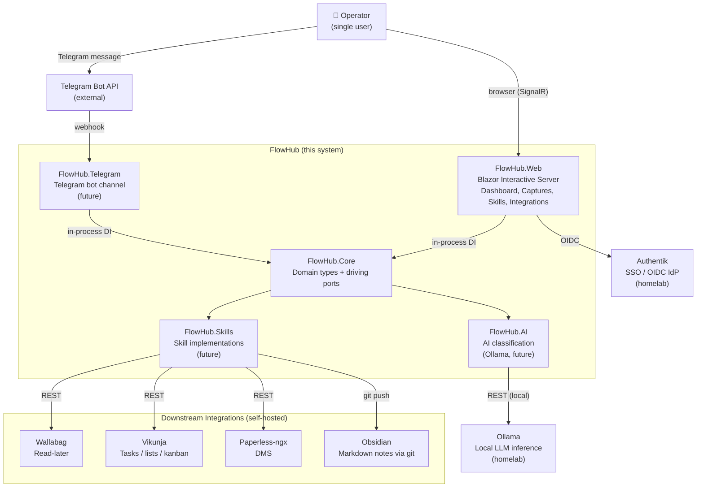
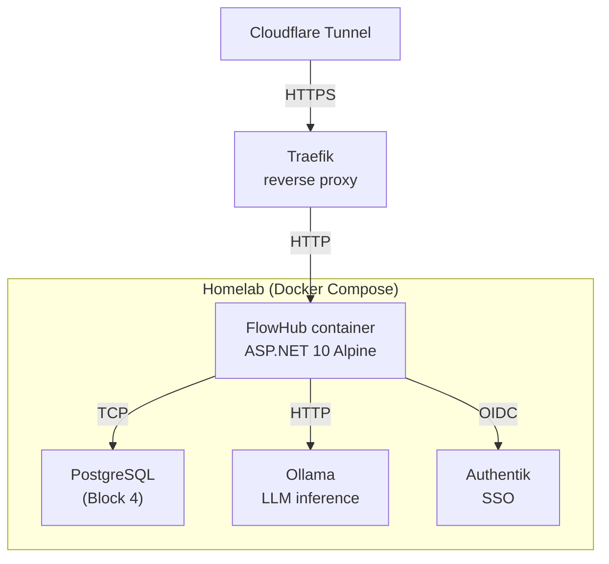

# FlowHub — System Context (C4 Level 1)

## Context Diagram

## Key relationships

| From | To | Protocol | Notes |
|---|---|---|---|
| Operator → FlowHub.Web | HTTP + SignalR (WebSocket) | Blazor Interactive Server; single long-lived circuit per session |
| Operator → Telegram Bot API | HTTPS | Operator sends message to bot; Telegram forwards via webhook |
| FlowHub.Web → FlowHub.Core | In-process DI | No HTTP — `@inject` services directly (per ADR 0001 §2) |
| FlowHub.Telegram → FlowHub.Core | In-process DI | Same process, same pattern |
| FlowHub.Core → FlowHub.AI | In-process | Classification service calls Ollama REST API for inference |
| FlowHub.AI → Ollama | HTTP REST (local) | `http://ollama:11434` — runs on the same homelab, never leaves the network |
| FlowHub.Skills → Integrations | HTTP REST / git | Each Skill writes to one or more downstream services via their APIs |
| FlowHub.Web → Authentik | OIDC (HTTPS) | Auth code flow; tokens in cookie; SignalR circuit reads cookie |

## Current state (Block 5 — submission)

The solution (`FlowHub.slnx`) contains six implemented projects; two folders remain
intentional, not-yet-implemented placeholders.

- **Implemented (in the solution, with code):**
  - `FlowHub.Web` — Blazor Web App (Interactive Server) + the REST API host
  - `FlowHub.Core` — domain types and driving/driven ports
  - `FlowHub.Api` — REST endpoint contracts for non-UI consumers
  - `FlowHub.AI` — LLM-backed classifier behind the `IClassifier` port (provider abstraction + keyword fallback)
  - `FlowHub.Persistence` — EF Core + PostgreSQL repositories and migrations
  - `FlowHub.Skills` — Wallabag and Vikunja `ISkillIntegration` adapters
- **Placeholder (folder only, not in the solution, planned for a later iteration):**
  `FlowHub.Telegram`, `FlowHub.Integrations` — each carries a `README.md` describing its planned role.
- **Not yet wired:** Authentik OIDC (dev bypass only), Ollama-hosted inference (see ADR 0007), the Telegram channel.
- **REST API:** available since Block 3 (`/api/v1/captures`, exercised live on the public demo).

## Deployment context (Block 5, future)

## Persistence Layer

FlowHub uses PostgreSQL 17 as its primary database, accessed via EF Core 10 with the Npgsql provider. The schema follows a migrations-first workflow: all schema changes are expressed as EF Core migration files committed to Git and applied as an idempotent SQL script at deploy time.

The Repository pattern separates domain logic from database access. Repository interfaces are defined in `FlowHub.Core` (returning domain types), with EF Core implementations in `FlowHub.Persistence`. Application-layer services (`ICaptureService`, `ISkillRegistry`, `IIntegrationHealthService`) compose repositories; they never reference `FlowHubDbContext` directly.

Local development uses `docker compose up postgres` to start a PostgreSQL container. `just db-migrate` applies pending migrations. `just run` starts the application, which auto-migrates via `MigrationRunner` for convenience.
