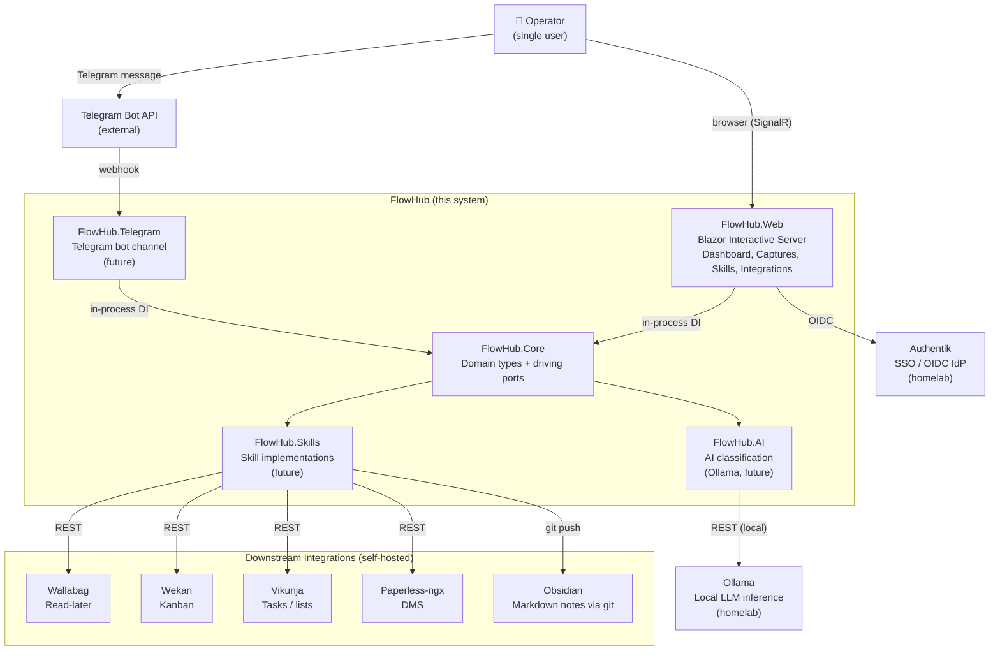
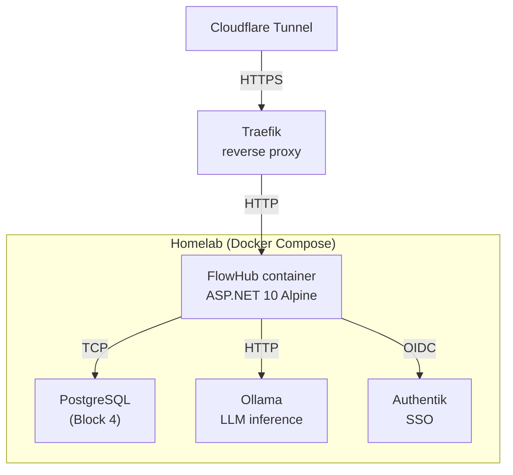

# FlowHub — System Context (C4 Level 1)

## Context Diagram

## Key relationships

| From | To | Protocol | Notes |
|---|---|---|---|
| Operator → FlowHub.Web | HTTP + SignalR (WebSocket) | Blazor Interactive Server; single long-lived circuit per session |
| Operator → Telegram Bot API | HTTPS | Operator sends message to bot; Telegram forwards via webhook |
| FlowHub.Web → FlowHub.Core | In-process DI | No HTTP — `@inject` services directly (per ADR 0001 §2) |
| FlowHub.Telegram → FlowHub.Core | In-process DI | Same process, same pattern |
| FlowHub.Core → FlowHub.AI | In-process | Classification service calls Ollama REST API for inference |
| FlowHub.AI → Ollama | HTTP REST (local) | `http://ollama:11434` — runs on the same homelab, never leaves the network |
| FlowHub.Skills → Integrations | HTTP REST / git | Each Skill writes to one or more downstream services via their APIs |
| FlowHub.Web → Authentik | OIDC (HTTPS) | Auth code flow; tokens in cookie; SignalR circuit reads cookie |

## Current state (Block 2)

- **Implemented:** FlowHub.Web + FlowHub.Core (6 pages, 3 stub services, DevAuthHandler)
- **Placeholder:** FlowHub.AI, FlowHub.Skills, FlowHub.Telegram, FlowHub.Integrations, FlowHub.Persistence (empty project folders)
- **Not yet wired:** Authentik OIDC (dev bypass only), Ollama, all downstream integrations
- **No REST API yet** — the API for non-UI consumers (Telegram, external automation) lands in Block 3

## Deployment context (Block 5, future)

