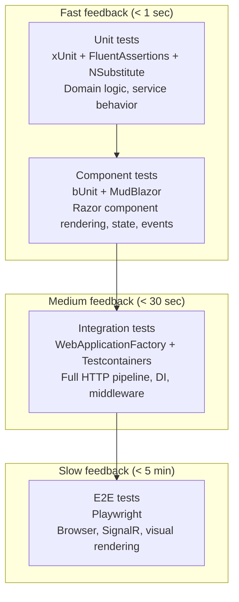

# FlowHub — Testing Strategy

## Overview

FlowHub uses a **layered testing approach** where each layer targets a specific feedback speed and confidence level. The strategy is designed so that most issues are caught early (in fast, isolated tests) and only integration-level concerns require the full stack.

## Test Layers



| Layer | Framework | What it tests | When to run | Block |
|---|---|---|---|---|
| **Unit** | xUnit + FluentAssertions + NSubstitute | Domain types, service logic, validators, pure functions | Every build (`make test`) | Block 2+ |
| **Component (bUnit)** | bUnit + MudBlazor.Services | Razor components render correctly, props/events wire up, states (loading/empty/error) display properly | Every build (`make test`) | Block 2 (current) |
| **Integration** | WebApplicationFactory + Testcontainers (PostgreSQL) | Full HTTP pipeline, DI composition, auth middleware, EF Core queries, API endpoints | Before merge / CI | Block 3 (when API + DB land) |
| **E2E** | Playwright | Browser-level: page navigation, SignalR circuit, visual layout, cross-page flows | Before release / CI | Block 5 (when deployed) |

## Current State (Block 2)

### What's implemented

- **31 bUnit component tests** in `tests/FlowHub.Web.ComponentTests/`
- **4 stub service behavior tests** (CaptureServiceStub: GetRecent, GetFailureCounts, Submit happy path, Submit empty-content rejection)
- **5 NeedsAttentionCard tests** (loading skeleton, all-clear, failure counts, orphan click callback, unhandled click callback)
- **3 SkillHealthCard tests** (loading, empty, populated)
- **3 NewCapture form tests** (render, skills load, skills-fail graceful degradation)
- **2 Captures list tests** (render all, results count)
- **14 smoke tests** using real Bogus stubs (not mocks) covering the full manual walkthrough: Dashboard → Captures list → Capture detail (orphan, unhandled, completed, not-found) → New Capture → Skills → Integrations

### What's deferred

| Test type | Why deferred | Lands in |
|---|---|---|
| Integration tests (WebApplicationFactory) | No real services or DB to test against yet — stubs are in-memory | Block 3 |
| E2E tests (Playwright) | No deployed environment; SignalR testing needs a running browser | Block 5 |
| Load/performance tests | Single-operator system, no scaling pressure | Not planned |

## Test Naming Convention

```
MethodName_StateUnderTest_ExpectedBehavior
```

Examples:
- `Render_Loading_ShowsSkeletons_WhenCountsIsNull`
- `SubmitAsync_RejectsEmptyContent`
- `Dashboard_NeedsAttention_ShowsOrphanAndUnhandledCounts`

The `CA1707` analyzer rule (no underscores in method names) is suppressed for test projects via `<NoWarn>CA1707</NoWarn>` in the test `.csproj`, since the CLAUDE.md convention requires underscores.

## Test Tools

| Tool | Version | Purpose |
|---|---|---|
| xUnit | 2.9.3 | Test framework + runner |
| bUnit | 1.40.0 | Blazor component test host — renders components in isolation without a browser |
| FluentAssertions | 6.12.2 | Readable assertion syntax (`cut.Markup.Should().Contain(...)`) |
| NSubstitute | 5.3.0 | Interface mocking for service dependencies |
| Bogus | 35.6.1 | Test data generation (used in stub services, not directly in tests) |
| MudBlazor.Services | (via MudBlazor 8.5.1) | Required in test DI for MudBlazor components to render |

## bUnit Test Patterns

### Basic component rendering
```csharp
var cut = RenderComponent<NeedsAttentionCard>(p =>
    p.Add(c => c.Counts, new FailureCounts(3, 1)));

cut.Markup.Should().Contain("3 orphan captures");
```

### Mocked service injection
```csharp
var captureService = Substitute.For<ICaptureService>();
Services.AddSingleton(captureService);
var cut = RenderComponent<Dashboard>();
```

### Real Bogus stub injection (smoke tests)
```csharp
Services.AddSingleton<ICaptureService>(new CaptureServiceStub());
var cut = RenderComponent<Dashboard>();
// Verifies against realistic seeded data
```

### MudBlazor popover requirement
Components using `MudSelect` or `MudMenu` require `MudPopoverProvider` pre-rendered:
```csharp
RenderComponent<MudPopoverProvider>(); // in constructor
```

### EventCallback verification
```csharp
var clicked = false;
var cut = RenderComponent<NeedsAttentionCard>(p =>
{
    p.Add(c => c.Counts, new FailureCounts(2, 0));
    p.Add(c => c.OnOrphanClick, EventCallback.Factory.Create(this, () => clicked = true));
});
cut.FindAll("button").First(b => b.TextContent.Contains("orphan")).Click();
clicked.Should().BeTrue();
```

## Acceptance Criteria Format

Each page's wireframe defines states that serve as implicit acceptance criteria:

| State | What to verify |
|---|---|
| **Default** | Data renders, correct values from service |
| **Loading** | Skeletons or progress indicator shown |
| **Empty** | Friendly message + call-to-action |
| **Error** | Alert with error message + Retry button |
| **Not found** | Alert for invalid ID / missing resource |

The smoke tests (`SmokeTests.cs`) automate verification of these states against the Bogus stubs for all 6 pages.

## Running Tests

```bash
make test          # run all tests (31 currently)
make test-watch    # watch mode for component tests
make build         # build also catches analyzer warnings (TreatWarningsAsErrors)
```
