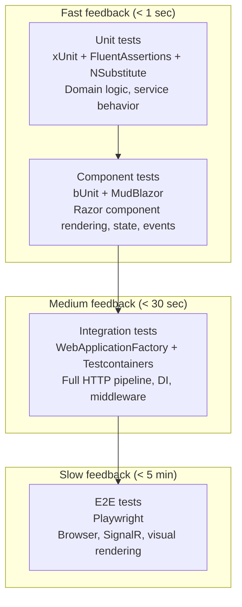

# FlowHub — Testing Strategy

## Overview

FlowHub uses a **layered testing approach** where each layer targets a specific feedback speed and confidence level. The strategy is designed so that most issues are caught early (in fast, isolated tests) and only integration-level concerns require the full stack.

## Test Layers



| Layer | Framework | What it tests | When to run | Block |
|---|---|---|---|---|
| **Unit** | xUnit + FluentAssertions + NSubstitute | Domain types, service logic, validators, pure functions | Every build (`just test`) | Block 2-3 (active) |
| **Component (bUnit)** | bUnit + MudBlazor.Services | Razor components render correctly, props/events wire up, states (loading/empty/error) display properly | Every build (`just test`) | Block 2-3 (active) |
| **Integration** | WebApplicationFactory + Testcontainers (PostgreSQL) | Full HTTP pipeline, DI composition, auth middleware, EF Core queries, API endpoints | Before merge / CI | Block 3 (active — API; Block 4 will add DB-backed) |
| **E2E** | Playwright | Browser-level: page navigation, SignalR circuit, visual layout, cross-page flows | Before release / CI | Block 5 (when deployed) |

## Current State (Block 3 — through Slice C)

> **Reading the test counts across this submission.** Different documents quote
> different totals because each is a **per-block, per-filter snapshot**, not a
> contradiction. The suite grew block by block, and the number depends on which
> `dotnet test` filter is applied:
>
> | Where | Block | Filter | Count |
> |---|---|---|---|
> | Block 1/2 Nachbereitung | 1–2 | bUnit components only | 31 |
> | This section / Block 3 | 3 | `Category!=AI` (default suite) | 99 |
> | Block 4 Nachbereitung (`docs/insights/block-4.md`) | 4 | `FullyQualifiedName!~E2ETests` (incl. AI + integration) | 223 (6 skipped) |
> | Block 5 Nachbereitung (`docs/insights/block-5.md`) | 5 | `Category!=AI&!=BetaSmoke&!=E2E` (offline default suite) | 171 (0 skipped) |
> | **Submission build (this doc)** | 5 | `Category!=AI&!=BetaSmoke&!=E2E` (offline default suite) | **253 (0 skipped)** |
>
> **Canonical figure at submission:** **253 offline tests green, 0 failed, 0
> skipped** (the default CI suite), and the suite additionally passes the AI +
> live-service integration tests when their categories are enabled (E2E excluded).
> The lower historical numbers are earlier per-block snapshots, retained in the
> Nachbereitungen as a progress record.

### Verified test run (rendered evidence)

Output of `just test` (`dotnet test FlowHub.slnx --filter "Category!=AI&Category!=BetaSmoke&Category!=E2E"`), run **2026-06-08 against commit `0d52c3c`**:

| Test project | Passed | Failed | Skipped |
|---|---:|---:|---:|
| FlowHub.Core.Tests | 4 | 0 | 0 |
| FlowHub.Skills.ContractTests | 17 | 0 | 0 |
| FlowHub.Api.IntegrationTests | 17 | 0 | 0 |
| FlowHub.Skills.Tests | 20 | 0 | 0 |
| FlowHub.Web.ComponentTests (bUnit) | 160 | 0 | 0 |
| FlowHub.Persistence.Tests (Testcontainers, real PostgreSQL) | 35 | 0 | 0 |
| **Total** | **253** | **0** | **0** |

`Passed! - Failed: 0, …` for every assembly; the persistence suite runs against a
real PostgreSQL container via Testcontainers (not InMemory). AI- and E2E-tagged
suites are trait-gated and excluded from this default run.

### What's implemented

- **99 default-suite tests** passing on `just test` (excluding `Category=AI`):
  - **82 component tests** in `tests/FlowHub.Web.ComponentTests/` covering Razor components, service stubs, classification, and the MassTransit pipeline
  - **17 API integration tests** in `tests/FlowHub.Api.IntegrationTests/` covering REST endpoints via `WebApplicationFactory<Program>`

- **Slice A (REST API)**: 17 integration tests via `Microsoft.AspNetCore.Mvc.Testing` covering `/api/v1/captures` endpoints:
  - `SubmitCaptureTests` — POST with validation (valid, empty content, invalid skill)
  - `ListCapturesTests` — GET with cursor pagination, stage/source filters
  - `GetCaptureByIdTests` — GET single capture, 404 not found
  - `RetryCaptureTests` — POST retry with stage validation
  - `ProblemDetailsFormatTests` — RFC 9457 wire format validation
  - `SmokeTests` — end-to-end captures workflow

- **Slice B (Async Pipeline)**: 6 MassTransit Test Harness tests covering event consumers:
  - `CaptureEnrichmentConsumerTests` — 2 tests (enrich keywords, handle invalid skill)
  - `SkillRoutingConsumerTests` — 2 tests (route by matched skill, handle orphan)
  - `LifecycleFaultObserverTests` — 2 tests (catch pipeline exceptions, log with EventId)

- **Slice B (Keywords)**: 5 `KeywordClassifier` tests covering deterministic classification logic

- **Block-2 Regression**: 16 `CaptureServiceStub` tests verifying backward compatibility:
  - Submit flow (new capture, appends to list, rejects empty)
  - GetRecent / GetFailureCounts (Block-2 smoke test data)
  - Lifecycle transitions (Classified, Routed, Orphan, Unhandled)
  - List with filters and cursor pagination
  - Reset for retry

- **Slice C (AI Integration)**: 25 mocked unit tests + 4 trait-gated live tests shipped in `tests/FlowHub.Web.ComponentTests/Ai/` and `tests/FlowHub.AI.IntegrationTests/`:
  - **3 `AiPrompts` tests** — `BuildMessages` structure (system-prompt first, user-message second) + system-prompt language guard (no German routing tokens)
  - **3 `AiClassificationResponse` tests** — `Description` / `AllowedValues` / nullable `Title` attributes for schema generation
  - **10 `AiClassifier` tests** — success path + 3 argument-forwarding tests (cancellation token, `MaxOutputTokens=300`, `Temperature=0.2`) + 5 fallback paths (`HttpRequestException`, `TaskCanceledException`, `JsonException`, schema-violation guard, `InvalidOperationException`) + `EventId 3010` logging contract
  - **8 `AddFlowHubAi` registration tests** — D8 matrix: no-provider, Anthropic without key, OpenRouter without key, Anthropic with key, OpenRouter with key, invalid value, case-insensitive parse, model override
  - **1 `KeywordClassifier` test** — `ClassifyAsync_AnyContent_KeywordClassifierReturnsNullTitle` locks the `Title=null` contract
  - **4 trait-gated live integration tests** in `tests/FlowHub.AI.IntegrationTests/` — Anthropic Haiku 4.5 (URL→Wallabag, todo→Vikunja) + OpenRouter Llama 3.1 (URL→Wallabag, todo→Vikunja)

### What's deferred

| Test type | Why deferred | Lands in |
|---|---|---|
| E2E tests (Playwright) | No deployed environment; SignalR testing needs a running browser | Block 5 |
| Integration tests with real DB (EF Core + Testcontainers) | Database persistence module not yet wired; `CaptureServiceStub` remains in-memory | Block 4 |
| Load/performance tests | Single-operator system, no scaling pressure | Not planned |

### Slice-C-specific patterns

#### Mocking `IChatClient` with NSubstitute

`Microsoft.Extensions.AI.IChatClient` defines both instance methods and extension methods. Extension methods (e.g. `GetResponseAsync<T>`) cannot be intercepted directly by NSubstitute. Instead, tests mock the underlying instance method that the extension calls internally:

```csharp
var chat = Substitute.For<IChatClient>();
chat.GetResponseAsync(
        Arg.Any<IEnumerable<ChatMessage>>(),
        Arg.Any<ChatOptions?>(),
        Arg.Any<CancellationToken>())
    .Returns(new ChatResponse(new ChatMessage(ChatRole.Assistant,
        JsonSerializer.Serialize(new { tags = new[] { "x" }, matched_skill = "Wallabag", title = "T" }))));
```

`AiClassifier` calls the typed extension `GetResponseAsync<AiClassificationResponse>(messages, options, ct)`, which internally invokes the instance method `GetResponseAsync(messages, options, ct)`. NSubstitute mocks the instance method; the typed extension's parser then sees the mock-supplied JSON and deserializes it.

#### Trait-gated live AI tests with `[SkippableFact]`

Live integration tests that require real API keys use the `[SkippableFact]` attribute (from `Xunit.SkippableFact` 1.4.13). Tests skip conditionally when environment variables are unset:

```csharp
[Trait("Category", "AI")]
public sealed class AnthropicHaikuLiveTests
{
    private static IClassifier BuildClassifier()
    {
        var apiKey = Environment.GetEnvironmentVariable("Ai__Anthropic__ApiKey");
        Skip.If(string.IsNullOrWhiteSpace(apiKey), "Ai__Anthropic__ApiKey not configured");
        // … build IClassifier from real configuration
    }

    [SkippableFact]
    public async Task ClassifyAsync_UrlContent_LiveAnthropicReturnsWallabagWithTitle()
    {
        var sut = BuildClassifier();
        var result = await sut.ClassifyAsync("https://en.wikipedia.org/wiki/Hexagonal_architecture", default);
        result.MatchedSkill.Should().Be("Wallabag");
        result.Title.Should().NotBeNullOrWhiteSpace();
    }
}
```

- `just test` excludes the `Category=AI` trait and all live tests remain **Skipped** (not silently passed)
- `just test-ai` runs only that trait — intended for operator-on-demand validation when keys are loaded
- CI runs `just test` only; live tests are operator-local

#### Trait filtering strategy

Tests use `[Trait("Category", "AI")]` to partition:
- **Default suite** (`Category!=AI`): 99 tests, runs every build, no external dependencies
- **Live AI suite** (`Category=AI`): 4 tests, runs on-demand, requires real API credentials

## Test Naming Convention

```
MethodName_StateUnderTest_ExpectedBehavior
```

Examples:
- `Render_Loading_ShowsSkeletons_WhenCountsIsNull`
- `SubmitAsync_RejectsEmptyContent`
- `Dashboard_NeedsAttention_ShowsOrphanAndUnhandledCounts`

The `CA1707` analyzer rule (no underscores in method names) is suppressed for test projects via `<NoWarn>CA1707</NoWarn>` in the test `.csproj`, since the CLAUDE.md convention requires underscores.

## Test Tools

| Tool | Version | Purpose |
|---|---|---|
| xUnit | 2.9.3 | Test framework + runner |
| bUnit | 1.40.0 | Blazor component test host — renders components in isolation without a browser |
| FluentAssertions | 6.12.2 | Readable assertion syntax (`cut.Markup.Should().Contain(...)`) |
| NSubstitute | 5.3.0 | Interface mocking for service dependencies |
| Bogus | 35.6.1 | Test data generation (used in stub services, not directly in tests) |
| MudBlazor.Services | (via MudBlazor 8.5.1) | Required in test DI for MudBlazor components to render |
| Xunit.SkippableFact | 1.4.13 | `[SkippableFact]` + `Skip.If(...)` — conditionally skip live AI tests when API keys are absent |

## bUnit Test Patterns

### Basic component rendering
```csharp
var cut = RenderComponent<NeedsAttentionCard>(p =>
    p.Add(c => c.Counts, new FailureCounts(3, 1)));

cut.Markup.Should().Contain("3 orphan captures");
```

### Mocked service injection
```csharp
var captureService = Substitute.For<ICaptureService>();
Services.AddSingleton(captureService);
var cut = RenderComponent<Dashboard>();
```

### Real Bogus stub injection (smoke tests)
```csharp
Services.AddSingleton<ICaptureService>(new CaptureServiceStub());
var cut = RenderComponent<Dashboard>();
// Verifies against realistic seeded data
```

### MudBlazor popover requirement
Components using `MudSelect` or `MudMenu` require `MudPopoverProvider` pre-rendered:
```csharp
RenderComponent<MudPopoverProvider>(); // in constructor
```

### EventCallback verification
```csharp
var clicked = false;
var cut = RenderComponent<NeedsAttentionCard>(p =>
{
    p.Add(c => c.Counts, new FailureCounts(2, 0));
    p.Add(c => c.OnOrphanClick, EventCallback.Factory.Create(this, () => clicked = true));
});
cut.FindAll("button").First(b => b.TextContent.Contains("orphan")).Click();
clicked.Should().BeTrue();
```

## Acceptance Criteria Format

Each page's wireframe defines states that serve as implicit acceptance criteria:

| State | What to verify |
|---|---|
| **Default** | Data renders, correct values from service |
| **Loading** | Skeletons or progress indicator shown |
| **Empty** | Friendly message + call-to-action |
| **Error** | Alert with error message + Retry button |
| **Not found** | Alert for invalid ID / missing resource |

The smoke tests (`SmokeTests.cs`) automate verification of these states against the Bogus stubs for all 6 pages.

## Running Tests

```bash
just test          # run all tests (99 default-suite, excl. AI)
just test-ai       # run AI trait-gated tests only (requires Ai__*__ApiKey env vars)
just test-watch    # watch mode for component tests
just build         # build also catches analyzer warnings (TreatWarningsAsErrors)
```

## Persistence Layer Testing

### Why Testcontainers Instead of InMemory

The `FlowHub.Persistence.Tests` project previously used `Microsoft.EntityFrameworkCore.InMemory`. Starting in Block 4, all persistence integration tests use Testcontainers PostgreSQL for these reasons:

1. **Provider parity:** InMemory does not enforce FK constraints, does not support `EF.Functions.ILike`, and differs in edge cases for cursor pagination. A test that passes against InMemory can fail against PostgreSQL.
2. **Realistic query plans:** Index-backed queries behave differently under InMemory (no query optimizer). Tests against real PostgreSQL catch missing indexes early.
3. **Migration coverage:** InMemory doesn't apply migrations. `MigrationSmokeTest` verifies all migrations apply cleanly against a real engine.

### Test Infrastructure

`PostgresFixture` (`tests/FlowHub.Persistence.Tests/Fixtures/PostgresFixture.cs`) starts one PostgreSQL container per test session (shared via `[Collection("Postgres")]`). Each test gets its own database (`testdb_<guid>`) via `CreateFreshDbAsync()`, which creates the database and applies all migrations before returning the context.

### Test Pyramid for Persistence

| Level | Location | Provider | Count (Block 4) |
|---|---|---|---|
| Unit (service orchestration) | `FlowHub.Web.ComponentTests` + `FlowHub.Persistence.Tests` | NSubstitute mocks | ~20 |
| Integration (repository) | `FlowHub.Persistence.Tests` | Testcontainers PostgreSQL | 15 |
| Integration (API endpoints) | `FlowHub.Api.IntegrationTests` | WebApplicationFactory | 17 |
| E2E (browser) | Playwright (planned) | Full stack | planned Block 5 |

### Acceptance Criteria (UC-09 to UC-13)

| Use Case | Test | Location |
|---|---|---|
| UC-09 Filter by Stage | `ListAsync_FiltersByStage` | `EfCaptureRepositoryTests` |
| UC-10 Filter by Tag | `ListAsync_FiltersByTag` (add in Block 5) | — |
| UC-11 Search by Content | `ListAsync_FiltersBySearchTerm` (add in Block 5) | — |
| UC-12 SkillRun history | `GetByCaptureIdAsync` | `EfSkillRunRepository` (add test in Block 5) |
| UC-13 Integration health history | `GetRecentSamplesAsync` | `EfIntegrationRepository` (add test in Block 5) |

## E2E Testing Plan (Playwright)

End-to-end tests cover the happy path for each major UI flow. Not yet automated in CI (deferred to post-submission); manual test plan is documented here.

### Test Cases

| Scenario | Steps | Expected |
|---|---|---|
| Submit Capture via UI | Navigate to `/`, type content in Quick Capture field, click Submit | Capture appears in recent captures list on Dashboard |
| View Captures List | Navigate to `/captures` | Table shows paginated Capture list; stage filter works |
| Retry Orphan Capture | Navigate to `/captures/{id}`, click Retry | Capture moves to Raw stage; toast confirms |
| Semantic Search (API) | `GET /api/v1/captures/search?q=EF+Core+query` | Returns Captures with semantically related content |

### CI Test Results Reference

Test results from the `ci.yml` GitHub Actions workflow are uploaded as `.trx` artifacts on every run. Screenshot the latest passing run for inclusion in the submission PDF:

1. Go to `github.com/freaxnx01/FlowHub-CAS-AISE/actions`.
2. Open the latest `CI` run on `main`.
3. Expand `Test` step to see test count and pass/fail breakdown.
4. Download `test-results` artifact for `.trx` file with full details.
